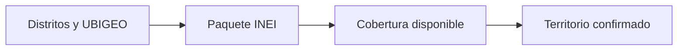

# Territorio

> Delimita los distritos y la cartografía que sostendrán la selección territorial.

## Objetivo

Confirmar un ámbito geográfico compatible con los marcos disponibles.

## Antes de empezar

Identifica los distritos del estudio y comprueba que exista información censal y cartográfica utilizable.

## Mapa de la pantalla

## Elementos de la pantalla

| Elemento | Para qué sirve | Qué cambia o produce |
|---|---|---|
| Distritos y UBIGEO | Definen el ámbito con identificadores territoriales. | Fija la lista de distritos que heredarán población, muestra y selección. |
| Paquete INEI | Aporta población y cartografía de referencia. | Carga el marco censal y geométrico correspondiente al paquete elegido. |
| Cobertura disponible | Indica años y zonas realmente incluidas. | Expone distritos sin respaldo antes de que entren al universo de cálculo. |
| Territorio confirmado | Habilita población y selección posterior. | Guarda sólo el ámbito validado y habilita sus totales poblacionales. |

## Cómo se usa

1. Busca y selecciona los distritos que integrarán el estudio.
2. Revisa año, cobertura y disponibilidad del paquete territorial.
3. Confirma el territorio solo cuando todos los distritos necesarios estén respaldados.

## Resultado y siguiente paso

El ámbito queda fijado y puede alimentar la definición de población.

## Estados, alertas y límites

- El marco INEI 2017 aporta la referencia principal; la interfaz puede incluir coberturas adicionales específicas, como Callao 2019.
- La disponibilidad visible no implica cobertura nacional automática.
- Cambiar el territorio puede invalidar cálculos y selecciones posteriores.

## Cómo interpretar lo que ves

La selección de distritos expresa el alcance deseado; la cobertura del paquete expresa lo que el marco puede respaldar. Ambas deben coincidir antes de confirmar. El nombre permite reconocer el distrito, pero el UBIGEO es la clave que enlaza población y cartografía. Un distrito seleccionado sin cobertura deja un hueco real en el universo: no es una advertencia informativa que pueda ignorarse.

## Ejemplo guiado

**Situación inicial.** Un estudio trabajará en tres distritos, pero el paquete territorial disponible cubre sólo dos en el año seleccionado.

**Acciones.** Selecciona los tres UBIGEO y abre el detalle de cobertura. Identifica el distrito ausente y decide si corresponde incorporar otro marco válido o corregir el alcance. Confirma sólo después de que cada distrito tenga población y geometría respaldadas.

**Resultado observable.** La cobertura muestra tres de tres distritos y el estado confirmado habilita Población. Si el alcance se reduce a dos, la exclusión queda deliberada y los cálculos siguientes usan esos dos, no el distrito faltante.

## Si algo no coincide

Si un distrito no aparece, comprueba UBIGEO, año y cobertura del paquete; no lo sustituyas por un nombre parecido. Si la geometría carga pero los totales no, vuelve a validar el componente censal del marco. Cambiar el territorio después de calcular muestra invalida población, cuotas y selección: regresa a esas etapas y recalcula antes de exportar.

## Ubicación en la jerarquía

- Padre: [[Hojas de ruta]].
