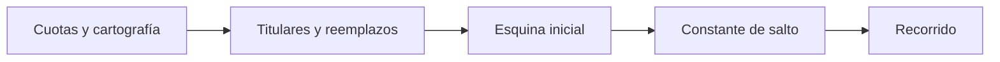

# Manzanas

> Selecciona UMP titulares y de reemplazo y define el recorrido sistemático dentro de cada manzana.

## Objetivo

Traducir las cuotas territoriales en unidades y reglas concretas para el encuestador.

## Antes de empezar

Confirma las cuotas, la cartografía, el método, la semilla y la política de reemplazos.

## Mapa de la pantalla

## Elementos de la pantalla

| Elemento | Para qué sirve | Qué cambia o produce |
|---|---|---|
| Cuotas y cartografía | Determinan dónde y cuánto seleccionar. | Cruza la asignación con geometrías elegibles. |
| Titulares y reemplazos | Asignan UMP principales y reservas. | Genera roles distintos dentro del mismo marco. |
| Esquina inicial | Fija el punto de arranque del recorrido. | Asigna una referencia operativa para comenzar la visita. |
| Constante de salto | Define el intervalo entre viviendas con floor(K). | Produce el paso entero que aplicará el equipo. |
| Recorrido | Integra selección y regla operativa. | Enlaza UMP, inicio y salto en una instrucción trazable. |

## Cómo se usa

1. Genera la selección de manzanas y revisa códigos, zonas y disponibilidad cartográfica.
2. Comprueba la correspondencia entre cada titular y sus reemplazos.
3. Define o valida la esquina inicial y la constante de salto para el recorrido.
4. Regenera solo cuando cambie una entrada que afecte la selección.

## Resultado y siguiente paso

Quedan listas las UMP y las instrucciones de recorrido para construir la entrega.

## Estados, alertas y límites

- La constante de salto es el intervalo entre viviendas y se muestra como floor(K); debe interpretarse junto con la esquina inicial.
- Los reemplazos dependen de la política definida en Muestra.
- Alterar cuotas, método, semilla o marco puede producir una selección diferente.

## Cómo interpretar lo que ves

Una manzana debe rastrearse a cuota, geometría y corrida. Titular y reemplazo son roles distintos. La esquina orienta el inicio; la constante de salto establece el intervalo entero. Ver la geometría no basta si faltan códigos para la hoja de ruta. Revisa estos componentes juntos antes de considerar operable una unidad.

## Ejemplo guiado

**Situación inicial.** Un distrito requiere dos UMP titulares y dos reservas para cada titular.

**Acciones.** Verifica cuota y cartografía, ejecuta la selección y revisa roles. Para cada titular, confirma esquina inicial y constante de salto antes de formar el recorrido.

**Resultado observable.** Hay dos titulares, cada uno con dos reservas vinculadas; todos conservan código, zona, geometría y regla operativa.

## Si algo no coincide

Si faltan manzanas, comprueba cobertura y cuota antes de repetir la corrida. Si una reserva aparece como titular, revisa la política, no la etiqueta exportada. Cuando cambien semilla, método o cuota, la corrida anterior queda obsoleta: regenera recorrido y entrega.

## Ubicación en la jerarquía

- Padre: [[Hojas de ruta]].
