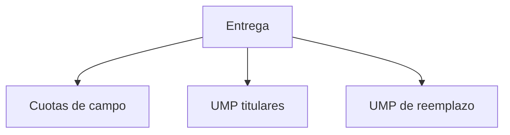

# Entrega

> Revisa y exporta el paquete territorial que se utilizará en campo.

**Etiqueta visible en la aplicación:** Entrega

## Propósito de la sección

Entrega comprueba desde tres perspectivas que la selección puede usarse en campo. Las cuotas expresan cuánto completar; los titulares indican dónde comenzar; los reemplazos establecen alternativas ordenadas. Así se evita distribuir archivos que no pertenecen a una misma corrida.

## Antes de recorrerla

Confirma que territorio, población, muestra y manzanas estén actualizados. La suma debe corresponder al N aprobado y los identificadores deben mantenerse. Un reemplazo sólo es válido si se produjo con el mismo marco y criterio que su titular.

## Mapa de la entrega

## Guía de destinos

| Destino | Cuándo entrar | Qué hacer allí | Qué deja listo |
|---|---|---|---|
| [[Cuotas de campo]] | Para revisar carga por ámbito o segmento | Contrastar sumas y distribución | Metas operativas |
| [[UMP titulares]] | Al preparar las primeras visitas | Verificar códigos, localización y corrida | La lista principal |
| [[UMP de reemplazo]] | Para preparar contingencias | Comprobar vínculo, orden y equivalencia | Alternativas por titular |

## Recorrido recomendado

Empieza por cuotas porque proporcionan el total de control. Continúa con titulares y comprueba que cada UMP aporte a una cuota. Finaliza con reemplazos, verificando que ninguna reserva aparezca sin titular u orden. Exporta cuando las tres vistas sean coherentes.

## Cómo interpretar el avance

Una tabla poblada no equivale a entrega cerrada. Las cuotas deben sumar N, los titulares cubrir la selección y los reemplazos estar vinculados sin duplicados. Diferencias de conteo, códigos vacíos o reservas sin rango exigen volver a la selección.

## Resultado

Queda un paquete trazable con objetivos, unidades iniciales y contingencias definidas antes de la operación.

## Ubicación en la jerarquía

- Padre: [[Hojas de ruta]].
