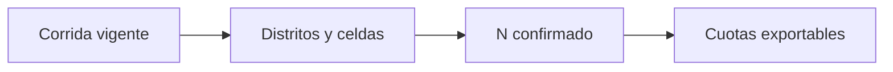

# Cuotas de campo

> Presenta la distribución final de entrevistas que debe ejecutar el equipo de campo.

**Etiqueta visible en la aplicación:** Cuotas

## Objetivo

Verificar que las cuotas coincidan con la corrida aprobada antes de exportarlas.

## Antes de empezar

Confirma población, tamaño muestral y cuotas en la sección Muestra.

## Mapa de la pantalla

## Elementos de la pantalla

| Elemento | Para qué sirve | Qué cambia o produce |
|---|---|---|
| Corrida vigente | Identifica la configuración que origina la entrega. | Permite saber si las cuotas pertenecen a los parámetros y semilla aprobados. |
| Distritos y celdas | Desagregan la asignación territorial y demográfica. | Distribuye el objetivo entre grupos que el equipo puede trabajar y supervisar. |
| N confirmado | Permite contrastar sumas y objetivo aprobado. | Bloquea la lectura como cerrada cuando la suma de celdas difiere del N. |
| Cuotas exportables | Integran el paquete de campo. | Genera la tabla operativa de la misma corrida que se está revisando. |

## Cómo se usa

1. Revisa que la corrida visible sea la aprobada.
2. Contrasta totales por distrito y celda con el N confirmado.
3. Exporta el paquete solo cuando no haya diferencias ni celdas inesperadas.

## Resultado y siguiente paso

Obtienes cuotas listas para distribuir junto con las UMP titulares y de reemplazo.

## Estados, alertas y límites

- El paquete deja de ser vigente si cambian cuotas, muestra o manzanas.
- Una diferencia entre la suma de cuotas y el N aprobado exige volver a Muestra.
- La exportación puede incluir libro de trabajo y documentos territoriales generados por bloque, zona o reemplazo.

## Cómo interpretar lo que ves

Empieza por la corrida: fecha, parámetros y semilla dicen si observas la selección vigente o una salida anterior. Después suma las celdas por distrito y segmento. El N confirmado es un control exacto: 399 o 401 no equivalen a 400. Una celda en cero puede ser válida si el universo la excluye; una celda vacía requiere revisar la asignación. La exportación debe reproducir esa misma corrida.

## Ejemplo guiado

**Situación inicial.** El N aprobado es 400 y debe distribuirse en tres distritos y dos segmentos de edad.

**Acciones.** Revisa que la corrida corresponda a la muestra aprobada. Suma primero cada distrito y después las seis celdas; confirma que ninguna combinación elegible quede vacía. Genera el archivo sólo cuando el total sea 400.

**Resultado observable.** La suma visible y exportada es 400. Cada fila identifica distrito, segmento y objetivo, y el archivo conserva la corrida de origen.

## Si algo no coincide

Si la suma difiere de N, detén la entrega y vuelve a Muestra para corregir distribución o redondeo. Si la pantalla suma 400 pero el archivo no, descarta ese archivo y regenera desde la corrida vigente. No edites el XLSX para cuadrarlo: romperías la relación entre N, cuotas y unidades seleccionadas.

## Ubicación en la jerarquía

- Padre: [[Entrega]].
