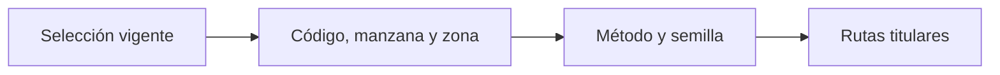

# UMP titulares

> Lista las unidades primarias seleccionadas como recorrido principal de campo.

**Etiqueta visible en la aplicación:** Titulares

## Objetivo

Comprobar que cada cuota tenga una UMP titular identificable y utilizable.

## Antes de empezar

Genera la selección de manzanas con la configuración aprobada.

## Mapa de la pantalla

## Elementos de la pantalla

| Elemento | Para qué sirve | Qué cambia o produce |
|---|---|---|
| Selección vigente | Vincula las UMP con la corrida actual. | Evita revisar unidades producidas por parámetros ya reemplazados. |
| Código, manzana y zona | Identifican cada unidad territorial. | Permiten localizar cada UMP sin depender de una etiqueta. |
| Método y semilla | Explican cómo se obtuvo la selección. | Hacen reproducible la lista y revelan si pertenece a otra corrida. |
| Rutas titulares | Forman el recorrido principal. | Generan el conjunto que debe visitarse antes de usar reservas. |

## Cómo se usa

1. Revisa códigos, manzanas, zonas y correspondencia con las cuotas.
2. Comprueba que la selección conserve método, semilla, marco y configuración.
3. Exporta o distribuye las rutas solo después de verificar la cartografía asociada.

## Resultado y siguiente paso

Las UMP titulares quedan listas para el paquete territorial de campo.

## Estados, alertas y límites

- Una UMP sin identificación o cartografía suficiente no debe liberarse a campo.
- La reproducibilidad exige conservar más que la semilla.
- Si cambia la selección, el paquete territorial anterior queda obsoleto.

## Cómo interpretar lo que ves

Cada fila es una unidad principal y debe reunir código, manzana, zona y referencia de corrida. Titular indica prioridad de visita; no permite sustituirla por cualquier otra unidad. Método y semilla vinculan la lista con la selección aprobada. El conteo debe responder al número de UMP previsto, no al número de entrevistas.

## Ejemplo guiado

**Situación inicial.** La corrida aprobada requiere dos UMP titulares en un distrito.

**Acciones.** Filtra el distrito, cuenta las filas y confirma que ambos códigos existan en cartografía. Contrasta método y semilla con la corrida antes de exportar.

**Resultado observable.** Aparecen exactamente dos titulares localizables, sin duplicados y vinculados a la corrida vigente.

## Si algo no coincide

Si el conteo difiere, revisa cuotas y selección de manzanas. Si falta código o zona, completa el marco; el nombre no sustituye al identificador. Una semilla distinta corresponde a otra corrida: vuelve a seleccionar o aprueba la nueva, pero no mezcles filas.

## Ubicación en la jerarquía

- Padre: [[Entrega]].
