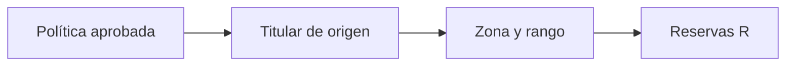

# UMP de reemplazo

> Organiza las unidades de reserva que pueden sustituir una UMP titular bajo la política aprobada.

**Etiqueta visible en la aplicación:** Reemplazos

## Objetivo

Entregar reemplazos trazables sin alterar discrecionalmente la selección.

## Antes de empezar

Define en Muestra la cantidad de reemplazos y si deben provenir de la misma zona o de otra.

## Mapa de la pantalla

## Elementos de la pantalla

| Elemento | Para qué sirve | Qué cambia o produce |
|---|---|---|
| Política aprobada | Fija cantidad y regla territorial. | Establece cuántas reservas corresponden a cada titular y dónde buscarlas. |
| Titular de origen | Mantiene la relación con la unidad principal. | Impide usar una reserva fuera de la unidad que puede sustituir. |
| Zona y rango | Ordenan la elegibilidad de cada reserva. | Define prioridad y equivalencia territorial. |
| Reservas R | Integran el paquete para contingencias. | Produce contingencias separadas de la ruta inicial. |

## Cómo se usa

1. Revisa la relación entre cada titular y sus reservas.
2. Comprueba zona, orden y cumplimiento de la política territorial.
3. Incluye las reservas en la entrega y documenta en campo cuál se activa y por qué.

## Resultado y siguiente paso

El paquete incorpora reemplazos controlados y auditables.

## Estados, alertas y límites

- Con cero reemplazos, esta lista debe quedar vacía.
- Una reserva solo se usa bajo el criterio operativo aprobado; no es una selección libre.
- Cambiar la política o las manzanas invalida la entrega previa.

## Cómo interpretar lo que ves

La reserva se lee siempre junto con su titular. Zona y rango explican por qué es elegible y cuándo considerarla. Más reservas no mejoran automáticamente el diseño: deben respetar la política y la equivalencia territorial. La marca R evita contabilizarlas como carga inicial o entrevistas adicionales.

## Ejemplo guiado

**Situación inicial.** Cada uno de dos titulares necesita dos reemplazos preseleccionados en la misma zona.

**Acciones.** Agrupa reservas por titular y comprueba rangos 1 y 2. Verifica que ningún código sea titular y reserva a la vez ni se repita para titulares incompatibles.

**Resultado observable.** Cada titular presenta dos reservas ordenadas y localizables; la exportación conserva vínculo y rol.

## Si algo no coincide

Si un titular carece de reservas, vuelve a Manzanas y revisa cobertura y política. Si una reserva cae fuera de zona, repite la selección; no la reasignes en el archivo. Los duplicados bloquean la entrega porque una misma contingencia podría activarse dos veces.

## Ubicación en la jerarquía

- Padre: [[Entrega]].
