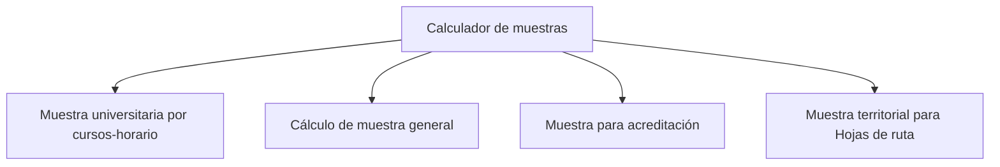

# Calculador de muestras

> Abre la mesa muestral correspondiente al tipo de estudio.

## Propósito de esta guía

**Calculador de muestras** organiza decisiones que cambian el diseño muestral y sus salidas. Abre la mesa muestral correspondiente al tipo de estudio. Cada vínculo de esta página conduce exclusivamente a un hijo directo y explica qué pregunta resuelve, qué debe comprobarse allí y qué evidencia queda preparada.

## Antes de recorrer este nivel

Elige el modo que corresponde a la unidad realmente seleccionable: curso-horario, marco general, componente de acreditación o unidad territorial. Cambiar de modo cambia la lógica del diseño, no sólo la presentación. En **Calculador de muestras**, confirma siempre que población, marco, parámetros y resultados pertenezcan a la misma versión. Si cambia una fuente, una regla de elegibilidad, una cuota o la semilla, deja de ser válida cualquier selección o salida anterior que dependa de ese dato.

## Mapa de navegación

## Guía de destinos

| Destino | Cuándo entrar | Qué hacer allí | Qué deja listo |
|---|---|---|---|
| [[Muestra de cursos-horario]] | cuando la selección debe realizarse sobre cursos-horario y representar estudiantes. | Recorre el diseño universitario desde los datos institucionales hasta el pase operativo. | un diseño universitario que conserva marco, cuotas, titulares y reservas. |
| [[Muestra general]] | cuando existe un marco que puede resolverse con una ruta muestral breve. | Calcula una muestra desde un marco disponible mediante una ruta breve de tres secciones. | un tamaño y una distribución sustentados por población, técnica y precisión. |
| [[Acreditación]] | cuando el estudio exige metas distintas para actores y canales institucionales. | Define metas separadas por actor y canal dentro de un estudio de acreditación. | componentes de acreditación con metas y supuestos separados. |
| [[Territorial]] | cuando la selección requiere planificación espacial de zonas, rutas o viviendas. | Deriva los estudios territoriales hacia la planificación espacial de rutas y viviendas. | insumos territoriales listos para continuar en Hojas de ruta. |

## Recorrido recomendado

1. **Muestra universitaria por cursos-horario:** Recorre el diseño universitario desde los datos institucionales hasta el pase operativo; al terminar, el resultado es un diseño universitario que conserva marco, cuotas, titulares y reservas.
2. **Cálculo de muestra general:** Calcula una muestra desde un marco disponible mediante una ruta breve de tres secciones; al terminar, el resultado es un tamaño y una distribución sustentados por población, técnica y precisión.
3. **Muestra para acreditación:** Define metas separadas por actor y canal dentro de un estudio de acreditación; al terminar, el resultado es componentes de acreditación con metas y supuestos separados.
4. **Muestra territorial para Hojas de ruta:** Deriva los estudios territoriales hacia la planificación espacial de rutas y viviendas; al terminar, el resultado es insumos territoriales listos para continuar en Hojas de ruta.

La primera configuración debe seguir ese orden: los insumos delimitan lo seleccionable; el método transforma esos insumos en metas o probabilidades; y el cierre conserva la evidencia. En **Calculador de muestras**, empieza por **Muestra universitaria por cursos-horario** y termina en **Muestra territorial para Hojas de ruta**. Para una revisión puntual puedes abrir directamente el destino causal, pero recalcula las tareas posteriores si modificas su entrada.

## Cómo interpretar avance y estados

En **Calculador de muestras**, **sin configurar** indica que falta una entrada indispensable; **no evaluado** significa que la entrada existe pero el cálculo aún no se ejecutó; **listo** exige resultados ligados a la versión actual; **requiere atención** señala una inconsistencia concreta. Un valor cero es un resultado numérico y no reemplaza a “sin dato”. En tablas, conserva denominadores, filtros y totales al pasar del resumen al detalle.

## Cómo se llega a cada pantalla

Este módulo no publica sus secciones ni sus pestañas en la dirección: la barra muestra `/calc-muestra` sin importar dónde estés. En consecuencia, ninguna vista interna puede compartirse por enlace ni recuperarse recargando, y volver a una pestaña concreta exige recorrer el módulo. Las notas de esta rama declaran esa misma dirección; su ubicación exacta la da la jerarquía de esta documentación, no la URL.

El modo tampoco se elige aquí: lo infiere el estudio del proyecto a partir de su familia y sus componentes. La única excepción enlazable es el modo universitario, al que se llega con `/calc-muestra?modo=aulas`; la aplicación lo aplica al abrir y retira el parámetro de la barra.

## Resultado de este nivel

Al completar **Calculador de muestras** quedan visibles los supuestos utilizados, las decisiones que transforman el marco y la evidencia necesaria para reproducir el resultado. Antes de entregar o transferir el diseño, comprueba que nombres, firmas, semillas, totales y fechas correspondan a la misma versión.

## Ubicación en la jerarquía

- Padre: [[Prosecnur]].
