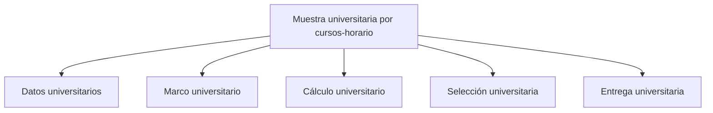

# Muestra de cursos-horario

> Recorre el diseño universitario desde los datos institucionales hasta el pase operativo.

## Propósito de esta guía

**Muestra universitaria por cursos-horario** organiza decisiones que cambian el diseño muestral y sus salidas. Recorre el diseño universitario desde los datos institucionales hasta el pase operativo. Cada vínculo de esta página conduce exclusivamente a un hijo directo y explica qué pregunta resuelve, qué debe comprobarse allí y qué evidencia queda preparada.

## Antes de recorrer este nivel

Trabaja con las bases de estudiantes y cursos-horario del mismo periodo académico. Conserva las llaves que los relacionan y verifica que facultad, sexo, nivel, sección y tamaño de curso procedan de las columnas asignadas. En **Muestra universitaria por cursos-horario**, confirma siempre que población, marco, parámetros y resultados pertenezcan a la misma versión. Si cambia una fuente, una regla de elegibilidad, una cuota o la semilla, deja de ser válida cualquier selección o salida anterior que dependa de ese dato.

## Mapa de navegación

## Guía de destinos

| Destino | Cuándo entrar | Qué hacer allí | Qué deja listo |
|---|---|---|---|
| [[Datos]] | al iniciar el diseño, antes de definir elegibilidad o calcular cuotas. | En la UI: **Datos**. Declara el estudio, sus fuentes y el mapeo de variables. | estudio identificado, fuentes conciliadas y variables asignadas. |
| [[Marco]] | cuando las fuentes ya están mapeadas y debes construir el universo elegible. | En la UI: **Marco**. Define elegibilidad y construye el universo de estudiantes y cursos-horario. | estudiantes y cursos-horario elegibles con cobertura explicada. |
| [[Cálculo]] | cuando el marco está validado y debes estimar tamaño, cuotas y distribución. | En la UI: **Cálculo**. Define diseño, cuotas y distribución de la muestra. | una propuesta muestral distribuida por facultad y sexo. |
| [[Selección]] | cuando las cuotas deben convertirse en cursos-horario titulares y reservas. | En la UI: **Selección**. Convierte cuotas en cursos-horario titulares, reemplazos y evidencia técnica. | una selección reproducible con método, semilla, probabilidades y reemplazos. |
| [[Entrega]] | cuando marco, cálculo y selección están cerrados y deben publicarse o entregarse. | En la UI: **Entrega**. Cierra el diseño, publica salidas y entrega el plan a Monitoreo. | salidas metodológicas y un pase operativo a Monitoreo. |

## Recorrido recomendado

1. **Datos universitarios:** En la UI: **Datos**. Declara el estudio, sus fuentes y el mapeo de variables; al terminar, el resultado es estudio identificado, fuentes conciliadas y variables asignadas.
2. **Marco universitario:** En la UI: **Marco**. Define elegibilidad y construye el universo de estudiantes y cursos-horario; al terminar, el resultado es estudiantes y cursos-horario elegibles con cobertura explicada.
3. **Cálculo universitario:** En la UI: **Cálculo**. Define diseño, cuotas y distribución de la muestra; al terminar, el resultado es una propuesta muestral distribuida por facultad y sexo.
4. **Selección universitaria:** En la UI: **Selección**. Convierte cuotas en cursos-horario titulares, reemplazos y evidencia técnica; al terminar, el resultado es una selección reproducible con método, semilla, probabilidades y reemplazos.
5. **Entrega universitaria:** En la UI: **Entrega**. Cierra el diseño, publica salidas y entrega el plan a Monitoreo; al terminar, el resultado es salidas metodológicas y un pase operativo a Monitoreo.

La primera configuración debe seguir ese orden: los insumos delimitan lo seleccionable; el método transforma esos insumos en metas o probabilidades; y el cierre conserva la evidencia. En **Muestra universitaria por cursos-horario**, empieza por **Datos universitarios** y termina en **Entrega universitaria**. Para una revisión puntual puedes abrir directamente el destino causal, pero recalcula las tareas posteriores si modificas su entrada.

## Cómo interpretar avance y estados

En **Muestra universitaria por cursos-horario**, **sin configurar** indica que falta una entrada indispensable; **no evaluado** significa que la entrada existe pero el cálculo aún no se ejecutó; **listo** exige resultados ligados a la versión actual; **requiere atención** señala una inconsistencia concreta. Un valor cero es un resultado numérico y no reemplaza a “sin dato”. En tablas, conserva denominadores, filtros y totales al pasar del resumen al detalle.

## Resultado de este nivel

Al completar **Muestra universitaria por cursos-horario** quedan visibles los supuestos utilizados, las decisiones que transforman el marco y la evidencia necesaria para reproducir el resultado. Antes de entregar o transferir el diseño, comprueba que nombres, firmas, semillas, totales y fechas correspondan a la misma versión.

## Ubicación en la jerarquía

- Padre: [[Calculador de muestras]].

