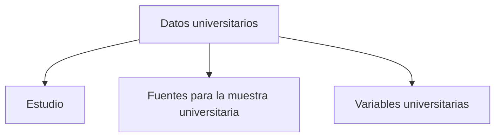

# Datos

> En la UI: **Datos**. Declara el estudio, acredita la consistencia de sus fuentes y mapea las variables.

## Propósito de esta guía

**Datos universitarios** organiza decisiones que cambian el diseño muestral y sus salidas. En la UI: **Datos**. Declara el estudio, sus fuentes y el mapeo de variables. Cada vínculo de esta página conduce exclusivamente a un hijo directo y explica qué pregunta resuelve, qué debe comprobarse allí y qué evidencia queda preparada.

## Antes de recorrer este nivel

Trabaja con las bases de estudiantes y cursos-horario del mismo periodo académico. Conserva las llaves que los relacionan y verifica que facultad, sexo, nivel, sección y tamaño de curso procedan de las columnas asignadas. En **Datos universitarios**, confirma siempre que población, marco, parámetros y resultados pertenezcan a la misma versión. Si cambia una fuente, una regla de elegibilidad, una cuota o la semilla, deja de ser válida cualquier selección o salida anterior que dependa de ese dato.

## Mapa de navegación

## Guía de destinos

| Destino | Cuándo entrar | Qué hacer allí | Qué deja listo |
|---|---|---|---|
| [[Estudio]] | cuando la mesa aún no tiene nombre, cliente, alcance y unidad definidos. | Registra nombre, cliente, alcance y unidad del diseño universitario. | identidad del estudio guardada. |
| [[Fuentes para la muestra universitaria]] | cuando el estudio está identificado y debes declarar las bases de estudiantes y cursos-horario. | En la UI: **Fuentes**. Declara los insumos y, en el bloque Consistencia entre fuentes, acredita sus llaves y enlaces. | fuentes con rol, periodo, procedencia y conciliación visibles. |
| [[Variables universitarias]] | cuando las columnas reales aún no están asignadas a estudiante, curso, facultad, sexo y demás roles. | En la UI: **Variables**. Asigna columnas reales a los roles del diseño. | mapeo de variables universitarias completo. |

## Recorrido recomendado

1. **Estudio:** Registra nombre, cliente, alcance y unidad del diseño universitario; al terminar, el resultado es identidad del estudio guardada.
2. **Fuentes para la muestra universitaria:** declara archivos u hojas y revisa allí mismo Consistencia entre fuentes; al terminar, quedan visibles rol, periodo, procedencia y conciliación.
3. **Variables universitarias:** En la UI: **Variables**. Asigna columnas reales a los roles del diseño; al terminar, el resultado es mapeo de variables universitarias completo.

La primera configuración debe seguir ese orden: los insumos delimitan lo seleccionable; el método transforma esos insumos en metas o probabilidades; y el cierre conserva la evidencia. En **Datos universitarios**, empieza por **Estudio** y termina en **Variables universitarias**. Para una revisión puntual puedes abrir directamente el destino causal, pero recalcula las tareas posteriores si modificas su entrada.

## Cómo interpretar avance y estados

En **Datos universitarios**, **sin configurar** indica que falta una entrada indispensable; **no evaluado** significa que la entrada existe pero el cálculo aún no se ejecutó; **listo** exige resultados ligados a la versión actual; **requiere atención** señala una inconsistencia concreta. Un valor cero es un resultado numérico y no reemplaza a “sin dato”. En tablas, conserva denominadores, filtros y totales al pasar del resumen al detalle.

## Resultado de este nivel

Al completar **Datos universitarios** quedan visibles los supuestos utilizados, las decisiones que transforman el marco y la evidencia necesaria para reproducir el resultado. Antes de entregar o transferir el diseño, comprueba que nombres, firmas, semillas, totales y fechas correspondan a la misma versión.

## Ubicación en la jerarquía

- Padre: [[Muestra de cursos-horario]].
