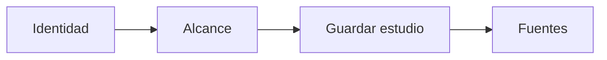

# Estudio
> Registra nombre, cliente, alcance y unidad del diseño universitario.
## Objetivo
Dar identidad al cálculo antes de vincular datos y variables.
## Antes de empezar
- Confirmar que la mesa activa es cursos-horario.
## Mapa de la pantalla

## Elementos de la pantalla
| Elemento | Para qué sirve | Qué cambia o produce |
|---|---|---|
| Nombre | Identifica el estudio | Titula la mesa y sus salidas |
| Cliente | Registra la institución | Completa metadata de entregables |
| Alcance | Describe población y propósito | Sitúa las decisiones muestrales |
## Cómo se usa
1. Completa identidad y alcance.
2. Revisa que correspondan al proyecto abierto.
3. Guarda y continúa en Fuentes para la muestra universitaria.
## Resultado y siguiente paso
- Estudio identificado; sigue Fuentes para la muestra universitaria.
## Estados, alertas y límites
- Cambiar de modo puede reiniciar la mesa después de confirmación.
- Esta pestaña no carga bases ni calcula la muestra.

## Cómo interpretar lo que ves

Nombre, cliente, alcance y unidad describen una sola decisión: qué diseño se está documentando. El alcance debe ser suficientemente preciso para distinguir población objetivo de la base disponible. En **Estudio**, **Nombre** fija la entrada o decisión inicial y **Alcance** muestra el producto que debe ser coherente con ella. Conserva la relación entre el estudiante, el curso-horario y la facultad; una coincidencia en el total no compensa una ruptura en esas unidades.

## Ejemplo guiado

**Situación.** La mesa se llama “Encuesta 2026”, pero el alcance sólo dice “universidad” y no aclara que el sorteo opera sobre cursos-horario.

**Decisión.** Completa **Cliente** y redacta **Alcance** distinguiendo población estudiantil, periodo académico y unidad seleccionable. Comprueba que esos datos correspondan al proyecto abierto antes de guardar.

**Resultado.** El estudio queda identificado como diseño universitario por cursos-horario; esa descripción aparecerá en los entregables y evita interpretar cada curso como si fuera un estudiante.

## Si algo no coincide

Si el nombre coincide pero cliente o alcance no, detén la carga de fuentes y corrige la identidad; de lo contrario las salidas quedarán atribuidas al estudio equivocado. Registra los valores observados en **Nombre** y **Alcance**, junto con la versión del marco y los parámetros activos. No corrijas una tabla o salida por separado: vuelve a la entrada causal y recalcula lo que dependa de ella.

## Ubicación en la jerarquía

- Padre: [[Datos]].
