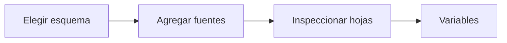

# Fuentes para la muestra universitaria
> En la UI: **Fuentes**. Declara archivos u hojas con estudiantes y cursos-horario.
## Objetivo
Vincular una base única o dos bases y registrar de dónde sale cada tabla.
## Antes de empezar
- Disponer de archivos o una hoja autorizada; si faltan, preparar la solicitud DTI.
## Mapa de la pantalla

## Elementos de la pantalla
| Elemento | Para qué sirve | Qué cambia o produce |
|---|---|---|
| Esquema | Elige base única o estudiantes + cursos-horario | Define el enlace esperado |
| Fuente | Vincula archivo/hoja | Registra procedencia y estado |
| Inspección | Lee columnas y hojas | Prepara mapeo por fuente |
| Solicitud DTI | Genera requerimiento de datos | Explicita columnas necesarias |
## Cómo se usa
1. Elige el esquema de fuentes.
2. Vincula cada archivo u hoja.
3. Inspecciona columnas sin inferir mapeos entre hojas.
4. Continúa en Variables universitarias.
## Resultado y siguiente paso
- Fuentes declaradas; sigue Variables universitarias.
## Estados, alertas y límites
- El mapeo es manual y exclusivo por hoja.
- Declarar una fuente no prueba que las bases enlacen correctamente.

## Cómo interpretar lo que ves

Una fuente cargada todavía no forma un marco: debe tener rol, periodo, llave y columnas asignadas. La consistencia se evalúa sobre la relación estudiante–curso-horario, no sólo sobre el número de filas. En **Fuentes para la muestra universitaria**, **Esquema** fija la entrada o decisión inicial y **Solicitud DTI** muestra el producto que debe ser coherente con ella. Conserva la relación entre el estudiante, el curso-horario y la facultad; una coincidencia en el total no compensa una ruptura en esas unidades.

## Ejemplo guiado

**Problema de entrada.** DTI entrega un archivo de matrícula y otro de programación docente, ambos llamados “base_final.xlsx”; sus esquemas no indican cuál contiene estudiantes ni cuál cursos-horario.

**Comprobación.** Asigna el **Rol** correcto a cada **Fuente**, abre **Inspección** y verifica columnas, hojas y periodo. Si falta una llave compartida, registra una **Solicitud DTI** en vez de inventar correspondencias.

**Salida observable.** Dos fuentes diferenciadas por función y procedencia, listas para evaluar su enlace.

## Si algo no coincide

Si los totales coinciden pero las llaves no, no declares consistencia; revisa tipos, espacios, duplicados y periodo académico en ambas fuentes. Registra los valores observados en **Esquema** y **Solicitud DTI**, junto con la versión del marco y los parámetros activos. No corrijas una tabla o salida por separado: vuelve a la entrada causal y recalcula lo que dependa de ella.

## Ubicación en la jerarquía

- Padre: [[Datos]].
