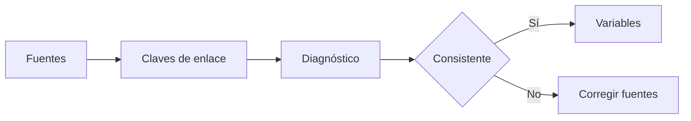

# Consistencia de fuentes
> En la UI: **Consistencia**. Comprueba el enlace entre estudiantes y cursos-horario.
## Objetivo
Detectar claves faltantes, huérfanos y duplicados antes de construir el marco.
## Antes de empezar
- Haber cargado una base única o las dos fuentes relacionadas.
## Mapa de la pantalla

## Elementos de la pantalla
| Elemento | Para qué sirve | Qué cambia o produce |
|---|---|---|
| Claves | Muestra columnas de relación | Define el enlace evaluado |
| Conteos | Resume filas y unidades únicas | Detecta desbalances |
| Incidencias | Lista huérfanos y duplicados | Señala correcciones necesarias |
## Cómo se usa
1. Revisa las claves propuestas o mapeadas.
2. Compara conteos de ambas fuentes.
3. Resuelve huérfanos y duplicados.
4. Continúa en Variables universitarias.
## Resultado y siguiente paso
- Enlace evaluado; sigue Variables universitarias.
## Estados, alertas y límites
- La consistencia se evalúa al cargar datos, no al calcular.
- Un diagnóstico rojo bloquea un marco confiable.

## Cómo interpretar lo que ves

Una fuente cargada todavía no forma un marco: debe tener rol, periodo, llave y columnas asignadas. La consistencia se evalúa sobre la relación estudiante–curso-horario, no sólo sobre el número de filas. En **Consistencia de fuentes**, **Claves** fija la entrada o decisión inicial y **Incidencias** muestra el producto que debe ser coherente con ella. Conserva la relación entre el estudiante, el curso-horario y la facultad; una coincidencia en el total no compensa una ruptura en esas unidades.

## Ejemplo guiado

**Caso hipotético.** La matrícula contiene 8 420 estudiantes; 8 301 encuentran curso-horario y 119 quedan sin coincidencia. Además, 14 claves aparecen duplicadas en programación.

**Lectura.** Usa **Claves** para comparar formato y unicidad, confirma los **Conteos** a ambos lados y agrupa las **Incidencias** en ausentes, duplicadas o inválidas. No compenses pérdidas añadiendo filas manuales.

**Cierre.** La conciliación declara 8 301 enlaces válidos y conserva 133 problemas trazables para corregir en la fuente.

## Si algo no coincide

Si los totales coinciden pero las llaves no, no declares consistencia; revisa tipos, espacios, duplicados y periodo académico en ambas fuentes. Registra los valores observados en **Claves** y **Incidencias**, junto con la versión del marco y los parámetros activos. No corrijas una tabla o salida por separado: vuelve a la entrada causal y recalcula lo que dependa de ella.

## Ubicación en la jerarquía

- Padre: [[Datos]].
