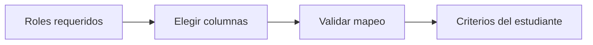

# Variables universitarias
> En la UI: **Variables**. Asigna columnas reales a los roles del diseño.
## Objetivo
Mapear identificador, facultad, curso-horario, sexo y demás variables requeridas.
## Antes de empezar
- Tener fuentes consistentes y columnas inspeccionadas.
## Mapa de la pantalla

## Elementos de la pantalla
| Elemento | Para qué sirve | Qué cambia o produce |
|---|---|---|
| Rol | Explica el uso muestral | Define qué necesita el motor |
| Selector de columna | Vincula una columna de su hoja | Guarda el mapeo por fuente |
| Estado requerido | Indica faltantes | Gatea la construcción del marco |
## Cómo se usa
1. Recorre los roles requeridos.
2. Elige la columna correcta en la fuente correspondiente.
3. Corrige ambigüedades y confirma el mapeo.
4. Continúa en Criterios del estudiante.
## Resultado y siguiente paso
- Variables mapeadas; sigue Criterios del estudiante.
## Estados, alertas y límites
- No se infiere una columna por nombre si el mapeo es ambiguo.
- Un rol requerido sin columna mantiene la sección incompleta.

## Cómo interpretar lo que ves

Una fuente cargada todavía no forma un marco: debe tener rol, periodo, llave y columnas asignadas. La consistencia se evalúa sobre la relación estudiante–curso-horario, no sólo sobre el número de filas. En **Variables universitarias**, **Rol** fija la entrada o decisión inicial y **Estado requerido** muestra el producto que debe ser coherente con ella. Conserva la relación entre el estudiante, el curso-horario y la facultad; una coincidencia en el total no compensa una ruptura en esas unidades.

## Ejemplo guiado

**Señal.** La columna “fac_nom” fue asignada a facultad, pero “sexo_est” continúa sin rol y el estado requerido impide construir cuotas.

**Resolución.** Revisa el significado de cada **Rol**, elige la columna real en **Selector de columna** y confirma tipo y valores antes de marcarla completa. No asignes una variable por semejanza del nombre si su contenido contradice el diccionario.

**Evidencia final.** El mapeo reconoce estudiante, curso-horario, facultad y sexo; **Estado requerido** deja de señalar la omisión.

## Si algo no coincide

Si los totales coinciden pero las llaves no, no declares consistencia; revisa tipos, espacios, duplicados y periodo académico en ambas fuentes. Registra los valores observados en **Rol** y **Estado requerido**, junto con la versión del marco y los parámetros activos. No corrijas una tabla o salida por separado: vuelve a la entrada causal y recalcula lo que dependa de ella.

## Ubicación en la jerarquía

- Padre: [[Datos]].
