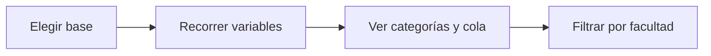

# Explorador de bases
> En la UI: **Explorador**. Mira las bases tal como se leyeron, sin criterios ni embudo.
## Objetivo
Inspeccionar columna por columna lo que cada fuente aporta al marco, antes de que ningún criterio la recorte.
## Antes de empezar
- Tener al menos una fuente cargada y el marco construido en Marco.
## Mapa de la pantalla

## Elementos de la pantalla
| Elemento | Para qué sirve | Qué cambia o produce |
|---|---|---|
| Conmutador de base | Elige cursos-horario o estudiantes | Cambia el universo inspeccionado |
| Índice de variables | Recorre las columnas disponibles | Selecciona qué describir |
| Distribución | Muestra categorías y su peso | Revela valores inesperados |
| Filtro por facultad | Acota la lectura | Describe sólo esas filas |
## Cómo se usa
1. Elige la base a explorar.
2. Busca la variable que te interesa en el índice.
3. Revisa sus categorías y abre la cola si hay muchas.
4. Acota por facultad cuando la distribución global no baste.
## Resultado y siguiente paso
- Comprensión de la base cruda; sigue Marco.
## Estados, alertas y límites
- La población no viaja en el proyecto guardado: se reconstruye recalculando el marco.
- Sin criterios ni embudo: lo que recorta cada criterio vive en Marco.

## Cómo interpretar lo que ves

Aquí las bases se muestran como se leyeron, no como el marco las deja. Una categoría rara en el Explorador es un problema de la fuente; una categoría ausente en Marco puede ser un criterio haciendo su trabajo. Distinguir las dos cosas evita corregir el sitio equivocado.

## Ejemplo guiado

**Señal.** Una variable tiene cuarenta categorías y muchas parecen variantes de la misma.

**Resolución.** Abre la cola, compara las etiquetas y decide si el problema es de la fuente o del diccionario antes de tocar criterios.

**Evidencia final.** La distribución se explica por el dato, no por un recorte invisible.

## Si algo no coincide

Si Estudiantes aparece vacío, no es que no haya datos: el proyecto guardado poda la población porque se puede reconstruir. Recalcula el marco en esta sesión.

## Ubicación en la jerarquía

- Padre: [[Datos]].
