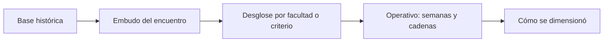

# Histórico
> En la UI: **Histórico**. Lee el estudio anterior para dimensionar el nuevo.
## Objetivo
Entender qué rindió el estudio previo —asistencia, efectividad, reemplazos y cuotas— para decidir cuántas aulas visitar este año.
## Antes de empezar
- Subir la base histórica en Fuentes. Esta pestaña no carga nada: lee.
## Mapa de la pantalla

## Elementos de la pantalla
| Elemento | Para qué sirve | Qué cambia o produce |
|---|---|---|
| Conmutador de desglose | Elige qué pregunta se responde | Muestra una vista por vez |
| Embudo | Reparte a los estudiantes entre sus salidas | Fija asistencia, efectividad y rendimiento |
| Matriz de titulares | Cuenta la historia de cada cadena | Muestra lo que costó cubrir el diseño |
| Cómo se dimensionó | Recorre del universo a la base analítica | Explica el recorte y la ponderación |
## Cómo se usa
1. Sube la base del estudio anterior en Fuentes.
2. Recorre el embudo para ver dónde se perdió gente.
3. Abre por facultad o por criterio según qué vayas a decidir.
4. Revisa titulares y reemplazos para estimar el esfuerzo de campo.
## Resultado y siguiente paso
- Tasas heredables para el cálculo; sigue Cálculo.
## Estados, alertas y límites
- Una facultad con muy pocas aulas hereda la tasa global en vez de publicar la suya.
- Sin las columnas del glosario del encuentro, el embudo se lee sobre matrícula y lo declara.

## Cómo interpretar lo que ves

El ADR 0060 fija la unidad: el encuentro con una persona en el aula, no la persona. Por eso `ya medidas` y `no elegibles` salen del denominador y no cuentan como pérdida: quien ya respondió en otro curso cumplió, y quien no pertenecía al estudio nunca debió contar. En **Embudo**, cada peldaño declara todo lo que pierde y también lo que recibe: hay aulas donde respondió gente que el conteo no vio, y ese tramo se dibuja aparte para que las cifras cierren.

## Ejemplo guiado

**Señal.** El embudo baja de 4.425 a 3.303 y la suma de las mermas visibles no explica la caída.

**Resolución.** Revisa las dos mermas del peldaño —quienes abrieron y no siguieron, y quienes nunca la abrieron— y el tramo de quienes respondieron sin estar en el conteo. La identidad que cierra es `elegibles presentes + presentes no contados = efectivas + no efectivas + no realizadas`.

**Evidencia final.** Las cifras del peldaño suman exactamente el siguiente.

## Si algo no coincide

Si una tasa supera el 100 %, comprueba qué denominador usa: el cumplimiento de cuota se mide contra la meta del diseño y puede pasarla; la efectividad se mide contra las personas a las que tocaba encuestar y no. No las llames igual.

## Ubicación en la jerarquía

- Padre: [[Datos]].
