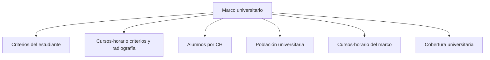

# Marco

> En la UI: **Marco**. Define elegibilidad, construye el universo de estudiantes y cursos-horario y decide cuántos alumnos representa cada CH.

## Propósito de esta guía

**Marco universitario** organiza decisiones que cambian el diseño muestral y sus salidas. Define elegibilidad, construye el universo de estudiantes y cursos-horario y decide el estadístico de alumnos por CH que consumirá Cálculo. La consistencia del enlace se acredita antes, dentro de Datos > Fuentes.

## Antes de recorrer este nivel

Trabaja con las bases de estudiantes y cursos-horario del mismo periodo académico. Conserva las llaves que los relacionan y verifica que facultad, sexo, nivel, sección y tamaño de curso procedan de las columnas asignadas. En **Marco universitario**, confirma siempre que población, marco, parámetros y resultados pertenezcan a la misma versión. Si cambia una fuente, una regla de elegibilidad, una cuota o la semilla, deja de ser válida cualquier selección o salida anterior que dependa de ese dato.

## Mapa de navegación

## Guía de destinos

| Destino | Cuándo entrar | Qué hacer allí | Qué deja listo |
|---|---|---|---|
| [[Criterios del estudiante]] | cuando las variables están mapeadas y debes decidir qué estudiantes integran la población elegible. | Define quién es elegible por formación, condición, edad, facultad y nivel. | reglas de elegibilidad del estudiante. |
| [[Cursos-horario criterios y radiografía]] | cuando debes ajustar reglas de curso viendo su efecto sobre elegibles por facultad y nivel. | En la UI: **Cursos-horario: criterios + radiografía**. Ajusta reglas de aula viendo dónde están los elegibles. | criterios de curso-horario con radiografía de cobertura. |
| [[Alumnos por CH]] | cuando el marco ejecutado ya publica la distribución completa por facultad. | Compara P25, mediana y media del marco elegible contra todos los CH y confirma un método global o por facultad. | decisión firmada que Cálculo y Selección consumen sin recalcular. |
| [[Población universitaria]] | cuando los criterios ya pueden aplicarse y necesitas inspeccionar la base elegible real. | En la UI: **Población**. Presenta elegibles y estructura de la base real. | población elegible cuantificada y descrita. |
| [[Cursos-horario del marco]] | cuando la población elegible debe agregarse en las unidades que realmente pueden sortearse. | En la UI: **Cursos-horario**. Inspecciona las unidades seleccionables del marco real. | lista de cursos-horario seleccionables. |
| [[Cobertura universitaria]] | cuando necesitas comprobar qué elegibles quedan incluidos o excluidos por facultad. | En la UI: **Cobertura**. Compara elegibles incluidos y excluidos por facultad. | diagnóstico de cobertura y exclusiones. |

## Recorrido recomendado

1. **Criterios del estudiante:** Define quién es elegible por formación, condición, edad, facultad y nivel; al terminar, el resultado es reglas de elegibilidad del estudiante.
2. **Cursos-horario criterios y radiografía:** En la UI: **Cursos-horario: criterios + radiografía**. Ajusta reglas de aula viendo dónde están los elegibles; al terminar, el resultado es criterios de curso-horario con radiografía de cobertura.
3. **Alumnos por CH:** compara P25, mediana y media por facultad y confirma la decisión firmada.
4. **Población universitaria:** presenta elegibles y estructura de la base real.
5. **Cursos-horario del marco:** inspecciona las unidades seleccionables del marco real.
6. **Cobertura universitaria:** compara elegibles incluidos y excluidos por facultad.

La primera configuración debe seguir ese orden: los insumos delimitan lo seleccionable; el marco ejecutado publica las distribuciones; Alumnos por CH fija el divisor firmado; y Cálculo lo consume. Empieza por **Criterios del estudiante** y termina en **Cobertura universitaria**.

## Cómo interpretar avance y estados

En **Marco universitario**, **sin configurar** indica que falta una entrada indispensable; **no evaluado** significa que la entrada existe pero el cálculo aún no se ejecutó; **listo** exige resultados ligados a la versión actual; **requiere atención** señala una inconsistencia concreta. Un valor cero es un resultado numérico y no reemplaza a “sin dato”. En tablas, conserva denominadores, filtros y totales al pasar del resumen al detalle.

## Resultado de este nivel

Al completar **Marco universitario** quedan visibles los supuestos utilizados, las decisiones que transforman el marco y la evidencia necesaria para reproducir el resultado. Antes de entregar o transferir el diseño, comprueba que nombres, firmas, semillas, totales y fechas correspondan a la misma versión.

## Ubicación en la jerarquía

- Padre: [[Muestra de cursos-horario]].
