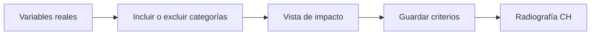

# Criterios del estudiante
> Define quién es elegible por formación, condición, edad, facultad y nivel.
## Objetivo
Construir la población elegible antes de perfilar los cursos-horario.
## Antes de empezar
- Tener variables universitarias mapeadas y datos descriptivos disponibles.
## Mapa de la pantalla

## Elementos de la pantalla
| Elemento | Para qué sirve | Qué cambia o produce |
|---|---|---|
| Catálogo | Lista variables y categorías observadas | Define criterios disponibles |
| Inclusión/exclusión | Acota elegibilidad | Cambia N de estudiantes elegibles |
| Razón metodológica | Explica cada criterio | Conserva sustento legible |
| Impacto | Anticipa filas incluidas/excluidas | Ayuda a revisar el filtro |
## Cómo se usa
1. Revisa variables y categorías observadas.
2. Define inclusiones o exclusiones deliberadas.
3. Lee la razón y el impacto.
4. Guarda y continúa en Cursos-horario criterios y radiografía.
## Resultado y siguiente paso
- Criterios de estudiante guardados; sigue Cursos-horario criterios y radiografía.
## Estados, alertas y límites
- Todo se incluye por defecto hasta que se restrinja.
- Cambiar criterios vuelve obsoleto el marco construido y exige reconstruirlo.

## Cómo interpretar lo que ves

Elegibilidad, inclusión y cobertura son etapas distintas. Una regla excluye personas del universo; la agregación por curso-horario transforma elegibles en unidades seleccionables; la cobertura muestra quién quedó representado o fuera. En **Criterios del estudiante**, **Catálogo** fija la entrada o decisión inicial y **Impacto** muestra el producto que debe ser coherente con ella. Conserva la relación entre el estudiante, el curso-horario y la facultad; una coincidencia en el total no compensa una ruptura en esas unidades.

## Ejemplo guiado

**Situación inicial: marco con casos fuera de alcance.** El marco incluye egresados y alumnos con matrícula anulada, aunque el estudio busca estudiantes activos de pregrado entre 18 y 29 años.

**Aplicación.** En **Catálogo**, activa formación, condición y edad; observa **Inclusión/exclusión** después de cada regla y escribe la **Razón metodológica**. Evalúa el **Impacto** por facultad antes de confirmar.

**Producto.** La población elegible excluye los casos fuera del alcance y permite explicar cuántos se retiraron por cada criterio, sin borrar las filas originales.

## Si algo no coincide

Si el total por facultad no suma la población elegible, busca facultades vacías, cursos sin llave o estudiantes asociados a más de una unidad antes de recalcular. Registra los valores observados en **Catálogo** y **Impacto**, junto con la versión del marco y los parámetros activos. No corrijas una tabla o salida por separado: vuelve a la entrada causal y recalcula lo que dependa de ella.

## Ubicación en la jerarquía

- Padre: [[Marco]].

