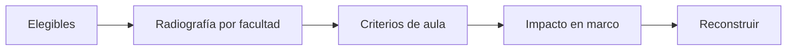

# Cursos-horario criterios y radiografía
> En la UI: **Cursos-horario: criterios + radiografía**. Ajusta reglas de aula viendo dónde están los elegibles.
## Objetivo
Definir criterios de curso-horario con evidencia por facultad, tipo, horario y tamaño.
## Antes de empezar
- Haber definido elegibilidad del estudiante y disponer de un frame descriptivo.
## Mapa de la pantalla

## Elementos de la pantalla
| Elemento | Para qué sirve | Qué cambia o produce |
|---|---|---|
| Radiografía | Muestra distribución de elegibles | Sitúa decisiones por facultad |
| Tipo de sesión/docente | Incluye categorías de aula | Cambia cursos-horario elegibles |
| Mínimo de elegibles | Exige tamaño suficiente | Excluye unidades pequeñas según regla |
| Excepción por facultad | Especializa el criterio general | Guarda una decisión localizada |
## Cómo se usa
1. Revisa la radiografía global y por facultad.
2. Ajusta criterios de aula del más general al particular.
3. Comprueba el impacto esperado.
4. Reconstruye el marco y continúa en Población universitaria.
## Resultado y siguiente paso
- Criterios de curso-horario confirmados; sigue Población universitaria.
## Estados, alertas y límites
- Los cambios no alteran el marco hasta reconstruirlo.
- Una excepción por facultad prevalece sólo en ese ámbito.

## Cómo interpretar lo que ves

Elegibilidad, inclusión y cobertura son etapas distintas. Una regla excluye personas del universo; la agregación por curso-horario transforma elegibles en unidades seleccionables; la cobertura muestra quién quedó representado o fuera. En **Cursos-horario criterios y radiografía**, **Radiografía** fija la entrada o decisión inicial y **Excepción por facultad** muestra el producto que debe ser coherente con ella. Conserva la relación entre el estudiante, el curso-horario y la facultad; una coincidencia en el total no compensa una ruptura en esas unidades.

## Ejemplo guiado

**Tensión operativa.** Exigir 15 elegibles por curso elimina casi todas las unidades de una facultad pequeña, mientras las demás conservan amplia oferta.

**Ajuste razonado.** Examina la **Radiografía**, separa tipo de sesión o docente y compara el **Mínimo de elegibles**. Si la cobertura institucional lo justifica, documenta una **Excepción por facultad** limitada a esa unidad; no reduzcas el umbral global sin medir su efecto.

**Resultado.** Los cursos seleccionables respetan una regla general y una excepción explícita cuya consecuencia queda cuantificada.

## Si algo no coincide

Si el total por facultad no suma la población elegible, busca facultades vacías, cursos sin llave o estudiantes asociados a más de una unidad antes de recalcular. Registra los valores observados en **Radiografía** y **Excepción por facultad**, junto con la versión del marco y los parámetros activos. No corrijas una tabla o salida por separado: vuelve a la entrada causal y recalcula lo que dependa de ella.

## Ubicación en la jerarquía

- Padre: [[Marco]].

