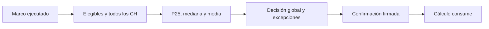

# Alumnos por CH
> Decide con el marco ejecutado qué estadístico de alumnos por curso-horario consumen Cálculo y Selección.

## Objetivo
Elegir por facultad un valor acreditado de alumnos por CH sin recalcular distribuciones en la interfaz.

## Antes de empezar
- Reconstruir el marco con los criterios vigentes.
- Confirmar que cada facultad tenga todos sus CH elegibles con `eligible_n` publicado.

## Mapa de la pantalla

## Elementos de la pantalla
| Elemento | Para qué sirve | Qué cambia o produce |
|---|---|---|
| Marco elegible | Muestra CH y matrículas que sobrevivieron a los criterios | Fija el denominador principal |
| Todos los CH | Conserva el contraste exigido por D2 | Evita confundir elegibilidad con universo bruto |
| P25, mediana y media | Presenta estadísticos calculados en R | Permite ponderar robustez y conservadurismo |
| Método por facultad | Hereda el método global o declara una excepción | Construye la decisión explícita |
| Confirmar decisión | Firma `frame_hash`, denominador y métodos | Invalida resultados y selección dependientes |

## Cómo se usa
1. Lee primero la fila Total y luego las facultades.
2. Compara el marco elegible con todos los CH; no mezcles ambos denominadores.
3. Conserva P25 si buscas una capacidad prudente o elige mediana/media con justificación.
4. Declara excepciones sólo donde la distribución por facultad lo sustente.
5. Confirma y vuelve a Cálculo: la cifra se consumirá desde R.

## Resultado y siguiente paso
- Decisión vigente ligada al `frame_hash`; sigue Cálculo para materializar CH requeridos.

## Estados, alertas y límites
- Un dato faltante invalida la facultad: React no usa otro campo como fallback.
- Cambiar el marco vuelve stale la decisión y exige confirmarla de nuevo.
- Confirmar borra cuotas y resultados anteriores; ninguna selección vieja conserva vigencia.
- El Total es informativo; Cálculo usa los valores efectivos por facultad.

## Ubicación en la jerarquía
- Padre: [[Marco]].
