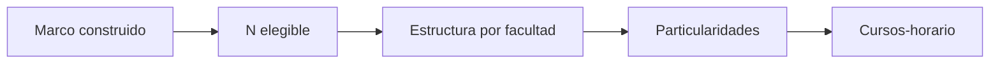

# Población universitaria
> En la UI: **Población**. Presenta elegibles y estructura de la base real.
## Objetivo
Comprobar cuántos estudiantes entran al marco y cómo se distribuyen.
## Antes de empezar
- Reconstruir el marco con criterios vigentes.
## Mapa de la pantalla

## Elementos de la pantalla
| Elemento | Para qué sirve | Qué cambia o produce |
|---|---|---|
| Total elegible | Cuantifica población válida | Fija N para el cálculo |
| Distribución | Desagrega por unidad y categorías | Permite revisar cobertura |
| Particularidades | Señala datos atípicos o faltantes | Advierte riesgos del marco |
## Cómo se usa
1. Confirma el total elegible.
2. Revisa distribución por facultad y sexo.
3. Investiga particularidades.
4. Continúa en Cursos-horario del marco.
## Resultado y siguiente paso
- Población elegible validada; sigue Cursos-horario del marco.
## Estados, alertas y límites
- Un marco desactualizado muestra advertencia y debe reconstruirse.
- N elegible no es todavía el tamaño de muestra.

## Cómo interpretar lo que ves

Lee **Total elegible** como el tamaño del universo que sobrevivió a los criterios, no como la muestra que finalmente se seleccionará. Después verifica que la **Distribución** por facultad y sexo sume ese total. **Particularidades** sirve para explicar residuos: estudiantes sin facultad, llaves incompletas o categorías que no pudieron ubicarse. Un total correcto puede ocultar una mala asignación interna, por lo que la suma y la composición deben validarse juntas.

## Ejemplo guiado

**Lectura de base.** Después de aplicar elegibilidad aparecen 6 780 estudiantes. Ingeniería concentra 41%, Arte 4% y 37 registros no tienen facultad.

**Análisis.** Comprueba **Total elegible**, abre la **Distribución** y revisa las **Particularidades** que producen la categoría vacía. Decide si esos 37 casos pueden clasificarse desde la fuente o deben permanecer excluidos del reparto estratificado.

**Resultado verificable.** La población queda descrita por facultad con denominadores explícitos y una decisión documentada para los valores faltantes.

## Si algo no coincide

Si el total por facultad no suma la población elegible, busca etiquetas vacías, códigos de facultad no reconocidos o estudiantes asociados a más de una unidad. Compara los identificadores de los casos de **Particularidades** con la fuente cargada. Corrige la llave o el mapeo que explica la diferencia y reconstruye el marco; editar únicamente el cuadro de distribución rompería la trazabilidad.

## Ubicación en la jerarquía

- Padre: [[Marco]].
