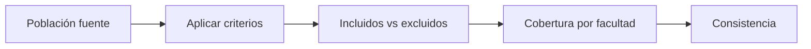

# Cobertura universitaria
> En la UI: **Cobertura**. Compara elegibles incluidos y excluidos por facultad.
## Objetivo
Comprobar que los criterios no produzcan vacíos o pérdidas desproporcionadas.
## Antes de empezar
- Construir el marco con criterios vigentes.
## Mapa de la pantalla

## Elementos de la pantalla
| Elemento | Para qué sirve | Qué cambia o produce |
|---|---|---|
| Barras de estudiantes | Compara elegibles/no elegibles | Muestra efecto de criterios |
| Barras de cursos-horario | Compara unidades incluidas/excluidas | Detecta pérdida de marco |
| Desagregación | Revisa facultades | Localiza brechas |
## Cómo se usa
1. Revisa cobertura global.
2. Compara facultades y tipos de unidad.
3. Vuelve a criterios si hay una pérdida problemática.
4. Continúa en Consistencia de fuentes.
## Resultado y siguiente paso
- Cobertura revisada; sigue Consistencia de fuentes.
## Estados, alertas y límites
- Sin marco construido, la pantalla explica qué falta.
- Criterios cambiados vuelven los conteos obsoletos.

## Cómo interpretar lo que ves

Compara las **Barras de estudiantes** con las **Barras de cursos-horario**: la primera muestra qué proporción de personas permanece elegible y la segunda si existen unidades suficientes para seleccionarlas. Una facultad puede conservar muchos estudiantes y, aun así, perder demasiados cursos-horario. Usa la **Desagregación** para identificar si la brecha proviene de un criterio deliberado o de horarios, secciones o llaves ausentes.

## Ejemplo guiado

**Pregunta.** ¿La exclusión de cursos nocturnos deja a una facultad sin representación aunque el total elegible siga alto?

**Contraste.** Compara las **Barras de estudiantes** con las **Barras de cursos-horario** y abre la **Desagregación** de la facultad afectada. Lee incluidos y excluidos sobre sus propios denominadores; una barra grande no prueba buena cobertura.

**Conclusión.** La pantalla identifica dónde la regla reduce personas, unidades o ambas y permite volver al criterio responsable.

## Si algo no coincide

Si estudiantes y cursos-horario muestran coberturas muy diferentes, revisa primero la unidad usada por cada barra. Después inspecciona la facultad afectada y clasifica las exclusiones por causa. No amplíes una cuota para compensar cursos ausentes: repara el marco o documenta la restricción antes de diseñar la selección.

## Ubicación en la jerarquía

- Padre: [[Marco]].
