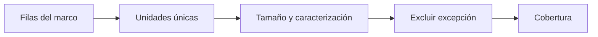

# Cursos-horario del marco
> En la UI: **Cursos-horario**. Inspecciona las unidades seleccionables del marco real.
## Objetivo
Verificar que cada curso-horario tenga claves, tamaño y caracterización suficientes.
## Antes de empezar
- Tener un marco vigente construido desde las fuentes.
## Mapa de la pantalla

## Elementos de la pantalla
| Elemento | Para qué sirve | Qué cambia o produce |
|---|---|---|
| Inventario | Lista cursos-horario únicos | Define unidades seleccionables |
| Tamaño | Muestra elegibles por unidad | Informa PPS y mínimos |
| Caracterización | Presenta facultad, horario y modalidad | Alimenta balance y auditoría |
## Cómo se usa
1. Revisa unidades y claves únicas.
2. Comprueba tamaños y categorías.
3. Resuelve exclusiones excepcionales con justificación.
4. Continúa en Cobertura universitaria.
## Resultado y siguiente paso
- Marco de cursos-horario inspeccionado; sigue Cobertura universitaria.
## Estados, alertas y límites
- Excluir una unidad exige reconstrucción del marco.
- Una fila de estudiante no equivale a un curso-horario único.

## Cómo interpretar lo que ves

Elegibilidad, inclusión y cobertura son etapas distintas. Una regla excluye personas del universo; la agregación por curso-horario transforma elegibles en unidades seleccionables; la cobertura muestra quién quedó representado o fuera. En **Cursos-horario del marco**, **Inventario** fija la entrada o decisión inicial y **Caracterización** muestra el producto que debe ser coherente con ella. Conserva la relación entre el estudiante, el curso-horario y la facultad; una coincidencia en el total no compensa una ruptura en esas unidades.

## Ejemplo guiado

**Caso de inventario.** La población elegible se agrega en 312 cursos-horario, pero 9 unidades no tienen tamaño y 4 comparten la misma clave.

**Revisión.** Ordena el **Inventario**, contrasta **Tamaño** con los estudiantes enlazados y usa **Caracterización** para detectar duplicados por facultad, sección y horario. Corrige la llave causal antes de permitir el sorteo.

**Estado esperado.** Una lista única de unidades seleccionables, cada una con tamaño observado y atributos suficientes para aplicar el método.

## Si algo no coincide

Si el total por facultad no suma la población elegible, busca facultades vacías, cursos sin llave o estudiantes asociados a más de una unidad antes de recalcular. Registra los valores observados en **Inventario** y **Caracterización**, junto con la versión del marco y los parámetros activos. No corrijas una tabla o salida por separado: vuelve a la entrada causal y recalcula lo que dependa de ella.

## Ubicación en la jerarquía

- Padre: [[Marco]].
