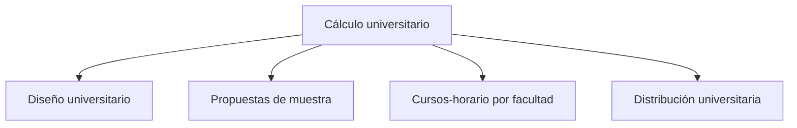

# Cálculo

> En la UI: **Cálculo**. Define diseño, cuotas y distribución de la muestra.

## Propósito de esta guía

**Cálculo universitario** organiza decisiones que cambian el diseño muestral y sus salidas. En la UI: **Cálculo**. Define diseño, cuotas y distribución de la muestra. Cada vínculo de esta página conduce exclusivamente a un hijo directo y explica qué pregunta resuelve, qué debe comprobarse allí y qué evidencia queda preparada.

## Antes de recorrer este nivel

Trabaja con las bases de estudiantes y cursos-horario del mismo periodo académico. Conserva las llaves que los relacionan y verifica que facultad, sexo, nivel, sección y tamaño de curso procedan de las columnas asignadas. En **Cálculo universitario**, confirma siempre que población, marco, parámetros y resultados pertenezcan a la misma versión. Si cambia una fuente, una regla de elegibilidad, una cuota o la semilla, deja de ser válida cualquier selección o salida anterior que dependa de ese dato.

## Mapa de navegación

## Guía de destinos

| Destino | Cuándo entrar | Qué hacer allí | Qué deja listo |
|---|---|---|---|
| [[Diseño universitario]] | cuando el marco está validado y debes fijar fórmula, confianza, error y efecto de diseño. | En la UI: **Diseño**. Configura fórmula, parámetros y supuestos del tamaño muestral. | parámetros del tamaño muestral. |
| [[Propuestas de muestra]] | cuando los parámetros están definidos y necesitas comparar metas y cuotas calculadas por el motor. | En la UI: **Propuestas**. Ejecuta el motor R y compara metas y cuotas por facultad. | propuesta de tamaño y cuotas por facultad. |
| [[Cursos-horario por facultad]] | cuando las cuotas de estudiantes deben convertirse en una cantidad factible de cursos-horario. | Convierte cuotas de estudiantes en cantidad estimada y definitiva de cursos-horario. | objetivo de cursos-horario por facultad. |
| [[Distribución universitaria]] | cuando necesitas comprobar cómo población y muestra se reparten por facultad y sexo. | En la UI: **Distribución**. Compara población y muestra por facultad y sexo. | distribución universitaria validada. |

## Recorrido recomendado

1. **Diseño universitario:** En la UI: **Diseño**. Configura fórmula, parámetros y supuestos del tamaño muestral; al terminar, el resultado es parámetros del tamaño muestral.
2. **Propuestas de muestra:** En la UI: **Propuestas**. Ejecuta el motor R y compara metas y cuotas por facultad; al terminar, el resultado es propuesta de tamaño y cuotas por facultad.
3. **Cursos-horario por facultad:** Convierte cuotas de estudiantes en cantidad estimada y definitiva de cursos-horario; al terminar, el resultado es objetivo de cursos-horario por facultad.
4. **Distribución universitaria:** En la UI: **Distribución**. Compara población y muestra por facultad y sexo; al terminar, el resultado es distribución universitaria validada.

La primera configuración debe seguir ese orden: los insumos delimitan lo seleccionable; el método transforma esos insumos en metas o probabilidades; y el cierre conserva la evidencia. En **Cálculo universitario**, empieza por **Diseño universitario** y termina en **Distribución universitaria**. Para una revisión puntual puedes abrir directamente el destino causal, pero recalcula las tareas posteriores si modificas su entrada.

## Cómo interpretar avance y estados

En **Cálculo universitario**, **sin configurar** indica que falta una entrada indispensable; **no evaluado** significa que la entrada existe pero el cálculo aún no se ejecutó; **listo** exige resultados ligados a la versión actual; **requiere atención** señala una inconsistencia concreta. Un valor cero es un resultado numérico y no reemplaza a “sin dato”. En tablas, conserva denominadores, filtros y totales al pasar del resumen al detalle.

## Resultado de este nivel

Al completar **Cálculo universitario** quedan visibles los supuestos utilizados, las decisiones que transforman el marco y la evidencia necesaria para reproducir el resultado. Antes de entregar o transferir el diseño, comprueba que nombres, firmas, semillas, totales y fechas correspondan a la misma versión.

## Ubicación en la jerarquía

- Padre: [[Muestra de cursos-horario]].
