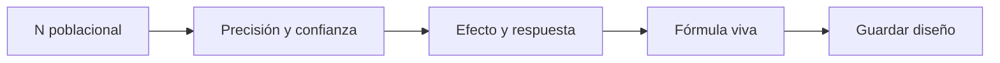

# Diseño universitario
> En la UI: **Diseño**. Configura fórmula, parámetros y supuestos del tamaño muestral.
## Objetivo
Definir el diseño que traduce población y precisión en una meta de entrevistas.
## Antes de empezar
- Contar con un marco vigente y cobertura revisada.
## Mapa de la pantalla

## Elementos de la pantalla
| Elemento | Para qué sirve | Qué cambia o produce |
|---|---|---|
| Fórmula viva | Explica el cálculo | Actualiza la cifra con cada parámetro |
| Confianza/precisión | Define incertidumbre objetivo | Cambia tamaño base |
| Efecto de diseño | Ajusta complejidad | Aumenta o reduce n |
| Respuesta esperada | Calcula sobremuestra | Produce meta operativa |
## Cómo se usa
1. Revisa N y la fórmula.
2. Ajusta precisión, confianza y proporción.
3. Configura efecto de diseño y respuesta.
4. Guarda y abre Propuestas.
## Resultado y siguiente paso
- Diseño persistido; el siguiente paso es Propuestas.
## Estados, alertas y límites
- La cifra reactiva no sustituye una corrida persistida.
- Los supuestos deben justificarse para el estudio concreto.

## Cómo interpretar lo que ves

El tamaño total, las cuotas de estudiantes y el número de cursos-horario responden a escalas diferentes. Revisa fórmula y supuestos antes de comparar propuestas, y comprueba cómo la distribución conserva facultad y sexo. En **Diseño universitario**, **Fórmula viva** fija la entrada o decisión inicial y **Respuesta esperada** muestra el producto que debe ser coherente con ella. Conserva la relación entre el estudiante, el curso-horario y la facultad; una coincidencia en el total no compensa una ruptura en esas unidades.

## Ejemplo guiado

**Situación inicial: sensibilidad del tamaño a la precisión.** Con 95% de confianza, 5% de precisión y efecto de diseño 1,2, la respuesta esperada es 420; al usar 3% sube a 1 050.

**Prueba.** Cambia sólo **Confianza/precisión**, conserva población y **Efecto de diseño**, y observa la **Fórmula viva**. No elijas el resultado por conveniencia presupuestal sin justificar el supuesto modificado.

**Resultado.** **Respuesta esperada** queda ligada a una combinación explícita de parámetros y puede reproducirse sin adivinar cuál valor produjo el tamaño.

## Si algo no coincide

Si la suma de cuotas no coincide con el tamaño objetivo, revisa redondeos, mínimos y topes; no ajustes manualmente la última facultad sin registrar el criterio. Registra los valores observados en **Fórmula viva** y **Respuesta esperada**, junto con la versión del marco y los parámetros activos. No corrijas una tabla o salida por separado: vuelve a la entrada causal y recalcula lo que dependa de ella.

## Ubicación en la jerarquía

- Padre: [[Cálculo]].

