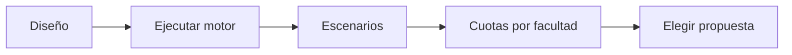

# Propuestas de muestra
> En la UI: **Propuestas**. Ejecuta el motor R y compara metas y cuotas por facultad.
## Objetivo
Elegir una propuesta calculada con parámetros explícitos y marco vigente.
## Antes de empezar
- Completar el diseño y disponer de población por facultad.
## Mapa de la pantalla

## Elementos de la pantalla
| Elemento | Para qué sirve | Qué cambia o produce |
|---|---|---|
| Ejecutar | Calcula con el motor R | Persiste una corrida |
| Escenarios | Compara alternativas | Presenta n y sobremuestra |
| Cuotas | Distribuye por facultad | Produce metas por unidad |
| Selección | Elige propuesta activa | Alimenta cursos-horario necesarios |
## Cómo se usa
1. Ejecuta el cálculo.
2. Compara escenarios y supuestos.
3. Revisa cuotas por facultad.
4. Elige una propuesta y abre Cursos-horario por facultad.
## Resultado y siguiente paso
- Propuesta activa; sigue Cursos-horario por facultad.
## Estados, alertas y límites
- Un marco o criterio cambiado vuelve la corrida obsoleta.
- La propuesta no selecciona todavía cursos-horario.

## Cómo interpretar lo que ves

El tamaño total, las cuotas de estudiantes y el número de cursos-horario responden a escalas diferentes. Revisa fórmula y supuestos antes de comparar propuestas, y comprueba cómo la distribución conserva facultad y sexo. En **Propuestas de muestra**, **Ejecutar** fija la entrada o decisión inicial y **Selección** muestra el producto que debe ser coherente con ella. Conserva la relación entre el estudiante, el curso-horario y la facultad; una coincidencia en el total no compensa una ruptura en esas unidades.

## Ejemplo guiado

**Escenario comparativo hipotético.** El motor ofrece 480 casos proporcionales y 520 con mínimos por facultad; la segunda opción aumenta la cuota de Arte de 8 a 24.

**Evaluación.** Pulsa **Ejecutar**, abre ambos **Escenarios** y compara las **Cuotas** con población y restricciones. Elige en **Selección** la propuesta que sostenga los mínimos declarados, no la que simplemente tenga el total menor.

**Producto.** Una propuesta identificada con tamaño, regla distributiva y cuotas específicas para cada facultad.

## Si algo no coincide

Si la suma de cuotas no coincide con el tamaño objetivo, revisa redondeos, mínimos y topes; no ajustes manualmente la última facultad sin registrar el criterio. Registra los valores observados en **Ejecutar** y **Selección**, junto con la versión del marco y los parámetros activos. No corrijas una tabla o salida por separado: vuelve a la entrada causal y recalcula lo que dependa de ella.

## Ubicación en la jerarquía

- Padre: [[Cálculo]].
