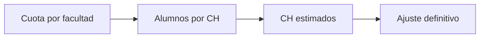

# Cursos-horario por facultad
> Convierte cuotas de estudiantes en cantidad estimada y definitiva de cursos-horario.
## Objetivo
Traducir metas de entrevistas a unidades operativas por facultad.
## Antes de empezar
- Tener propuesta activa y tamaños de curso-horario observados.
## Mapa de la pantalla

## Elementos de la pantalla
| Elemento | Para qué sirve | Qué cambia o produce |
|---|---|---|
| Cuota | Muestra entrevistas objetivo | Punto de partida por facultad |
| Rendimiento CH | Estima alumnos alcanzables | Convierte entrevistas en unidades |
| CH definitivos | Ajusta meta operativa | Fija cantidad para selección |
## Cómo se usa
1. Revisa cuota y tamaño observado.
2. Comprueba el cálculo de cursos-horario.
3. Ajusta sólo con razón operativa.
4. Guarda y abre Distribución.
## Resultado y siguiente paso
- Meta de cursos-horario por facultad; sigue Distribución.
## Estados, alertas y límites
- Un promedio no reemplaza la distribución real de tamaños.
- Ajustar cursos-horario no cambia silenciosamente la cuota de estudiantes.

## Cómo interpretar lo que ves

El tamaño total, las cuotas de estudiantes y el número de cursos-horario responden a escalas diferentes. Revisa fórmula y supuestos antes de comparar propuestas, y comprueba cómo la distribución conserva facultad y sexo. En **Cursos-horario por facultad**, **Cuota** fija la entrada o decisión inicial y **CH definitivos** muestra el producto que debe ser coherente con ella. Conserva la relación entre el estudiante, el curso-horario y la facultad; una coincidencia en el total no compensa una ruptura en esas unidades.

## Ejemplo guiado

**Conversión hipotética.** Medicina requiere 120 estudiantes y sus cursos observados promedian 30 elegibles; cuatro unidades bastarían en teoría, pero una tiene sólo 12.

**Cálculo operativo.** Parte de **Cuota**, revisa **Rendimiento CH** real y redondea considerando tamaños heterogéneos y reservas. No dividas por un promedio institucional que oculte la facultad.

**Resultado.** **CH definitivos** muestra cuántos cursos titulares necesita cada facultad para aproximar la cuota estudiantil sin prometer una cobertura imposible.

## Si algo no coincide

Si la suma de cuotas no coincide con el tamaño objetivo, revisa redondeos, mínimos y topes; no ajustes manualmente la última facultad sin registrar el criterio. Registra los valores observados en **Cuota** y **CH definitivos**, junto con la versión del marco y los parámetros activos. No corrijas una tabla o salida por separado: vuelve a la entrada causal y recalcula lo que dependa de ella.

## Ubicación en la jerarquía

- Padre: [[Cálculo]].

