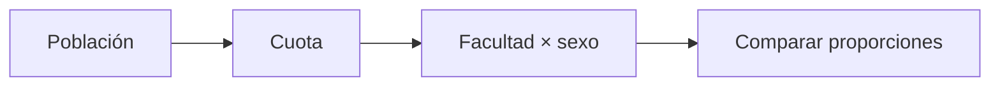

# Distribución universitaria
> En la UI: **Distribución**. Compara población y muestra por facultad y sexo.
## Objetivo
Comprobar que las cuotas reproduzcan la estructura relevante del marco.
## Antes de empezar
- Tener una propuesta calculada y distribución poblacional válida.
## Mapa de la pantalla

## Elementos de la pantalla
| Elemento | Para qué sirve | Qué cambia o produce |
|---|---|---|
| Distribución poblacional | Presenta estructura fuente | Referencia de representatividad |
| Distribución muestral | Presenta cuotas | Permite comparar proporciones |
| Barras por facultad/sexo | Visualiza diferencias | Señala desbalances |
## Cómo se usa
1. Compara población y muestra.
2. Revisa cada facultad y sexo.
3. Vuelve al diseño si el desbalance es injustificado.
4. Continúa con Objetivo de muestra en la sección Selección.
## Resultado y siguiente paso
- Distribución revisada; sigue la sección Selección.
## Estados, alertas y límites
- La distribución depende de la última corrida persistida.
- Redondeos por cuota pueden producir diferencias pequeñas documentadas.

## Cómo interpretar lo que ves

El tamaño total, las cuotas de estudiantes y el número de cursos-horario responden a escalas diferentes. Revisa fórmula y supuestos antes de comparar propuestas, y comprueba cómo la distribución conserva facultad y sexo. En **Distribución universitaria**, **Distribución poblacional** fija la entrada o decisión inicial y **Barras por facultad/sexo** muestra el producto que debe ser coherente con ella. Conserva la relación entre el estudiante, el curso-horario y la facultad; una coincidencia en el total no compensa una ruptura en esas unidades.

## Ejemplo guiado

**Desbalance hipotético.** La población es 58% mujeres, pero una propuesta asigna 71% de la muestra porque dos facultades feminizadas recibieron mínimos altos.

**Diagnóstico visual.** Coloca **Distribución poblacional** y **Distribución muestral** en la misma escala; usa las **Barras por facultad/sexo** para localizar el origen, no para retocar celdas. Si el desvío contradice el diseño, vuelve a cuotas o restricciones.

**Conclusión.** La composición final queda explicada por asignaciones concretas y no por una diferencia agregada sin causa.

## Si algo no coincide

Si la suma de cuotas no coincide con el tamaño objetivo, revisa redondeos, mínimos y topes; no ajustes manualmente la última facultad sin registrar el criterio. Registra los valores observados en **Distribución poblacional** y **Barras por facultad/sexo**, junto con la versión del marco y los parámetros activos. No corrijas una tabla o salida por separado: vuelve a la entrada causal y recalcula lo que dependa de ella.

## Ubicación en la jerarquía

- Padre: [[Cálculo]].
