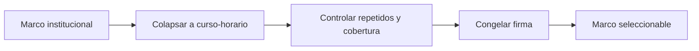

# Marco de cursos-horario
> En la UI: **Marco de aulas**. Congela las unidades seleccionables y deja una firma reproducible antes del sorteo.
## Objetivo
Confirmar que cada fila representa un curso-horario elegible y que el marco usado en la selección puede auditarse.
## Antes de empezar
- Construir el marco universitario y resolver advertencias de consistencia.
- Disponer de cursos-horario con facultad, tamaño y criterios de elegibilidad.
## Mapa de la pantalla

## Elementos de la pantalla
| Elemento | Para qué sirve | Qué cambia o produce |
|---|---|---|
| Reglas del método | Explica unidad, repetidos, reemplazos y privacidad | Delimita el sorteo defendible |
| Estados vivos | Resume si cálculo, comparador y reemplazos están listos | Señala trabajo pendiente |
| Sello de reproducibilidad | Muestra firma, fecha, filas y estudiantes únicos | Identifica el marco congelado |
| Alerta de cambio | Compara firma actual y firma usada | Invalida selecciones desactualizadas |
## Cómo se usa
1. Comprueba la unidad curso-horario y el número de filas.
2. Revisa cobertura, estudiantes repetidos y reglas de reemplazo.
3. Confirma la firma del marco que se usará al comparar métodos.
4. Si el marco cambió, repite la comparación y la selección.
## Resultado y siguiente paso
- Marco seleccionable y firmado; continúa con Objetivo de muestra.
## Estados, alertas y límites
- Sin marco construido no hay auditoría real ni selección reproducible.
- Un cambio posterior de firma deja obsoletos titulares y reemplazos.
- Los identificadores internos no forman parte de las salidas para cliente.

## Cómo interpretar lo que ves

La firma del marco identifica exactamente qué cursos podían entrar al sorteo. Cualquier cambio posterior en filtros, cursos o tamaños exige una nueva firma y vuelve incomparable la selección anterior. En **Marco de cursos-horario**, **Reglas del método** fija la entrada o decisión inicial y **Alerta de cambio** muestra el producto que debe ser coherente con ella. Conserva la relación entre el estudiante, el curso-horario y la facultad; una coincidencia en el total no compensa una ruptura en esas unidades.

## Ejemplo guiado

**Alerta de reproducibilidad.** Un curso nuevo aparece después de congelar el marco y cambia el total de 312 a 313 unidades.

**Control.** Compara **Estados vivos** con las **Reglas del método**, identifica la unidad añadida y decide si corresponde reabrir el diseño. Si aceptas el cambio, genera un nuevo **Sello de reproducibilidad**; no ignores **Alerta de cambio** para conservar titulares antiguos.

**Cierre.** Una firma inequívoca identifica exactamente el universo utilizado por el próximo sorteo.

## Si algo no coincide

Si la firma cambia sin una modificación reconocida, revisa ordenamiento, normalización de llaves y fuente antes de ejecutar el sorteo. Registra los valores observados en **Reglas del método** y **Alerta de cambio**, junto con la versión del marco y los parámetros activos. No corrijas una tabla o salida por separado: vuelve a la entrada causal y recalcula lo que dependa de ella.

## Ubicación en la jerarquía

- Padre: [[Selección]].
