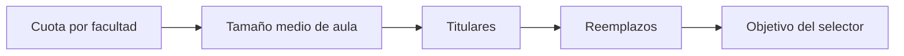

# Objetivo de muestra
> Traduce las cuotas de estudiantes en titulares, reservas y parámetros técnicos para seleccionar cursos-horario.
## Objetivo
Fijar cuántos cursos-horario necesita cada facultad y qué balance debe preservar el selector.
## Antes de empezar
- Tener cuotas por facultad calculadas o, de forma provisional, cuotas fijadas en el marco.
- Definir la profundidad operativa de reemplazos esperada.
## Mapa de la pantalla

## Elementos de la pantalla
| Elemento | Para qué sirve | Qué cambia o produce |
|---|---|---|
| Flujo por facultad | Convierte cuota validada en cursos-horario | Define titulares requeridos |
| Reservas por titular | Fija la profundidad de reemplazo | Amplía la bolsa operativa, no el n estadístico |
| Grupos de tamaño | Clasifica cursos-horario comparables | Mejora equivalencia de titulares y reservas |
| Panel avanzado | Ajusta semilla, corridas, candidatas y pesos | Cambia reproducibilidad y optimización |
## Cómo se usa
1. Revisa la cuota de estudiantes de cada facultad.
2. Valida la conversión a cursos-horario titulares.
3. Define reemplazos y grupos de tamaño.
4. Usa los controles avanzados solo si el diseño técnico lo exige.
## Resultado y siguiente paso
- Objetivo explícito por facultad; continúa con Comparar métodos.
## Estados, alertas y límites
- Las cuotas no validadas permiten explorar, pero no cerrar el diseño.
- Los reemplazos no aumentan la muestra estadística objetivo.
- Más candidatas u optimización exigen probabilidades auditadas por simulación.

## Cómo interpretar lo que ves

El objetivo traduce cuotas de estudiantes a titulares y reservas por curso-horario. Debe conservar metas por facultad y parámetros que controlan cuántas unidades se seleccionan y cuántas quedan disponibles como reemplazo. En **Objetivo de muestra**, **Flujo por facultad** fija la entrada o decisión inicial y **Panel avanzado** muestra el producto que debe ser coherente con ella. Conserva la relación entre el estudiante, el curso-horario y la facultad; una coincidencia en el total no compensa una ruptura en esas unidades.

## Ejemplo guiado

**Problema de factibilidad hipotético.** Derecho necesita 6 titulares con 2 reservas cada uno, pero el marco sólo contiene 14 cursos elegibles y tres pertenecen al mismo grupo de tamaño.

**Decisión.** Revisa **Flujo por facultad**, **Reservas por titular** y **Grupos de tamaño**. Usa **Panel avanzado** para ajustar profundidad o restricciones manteniendo la cuota; no dupliques unidades para completar el objetivo.

**Resultado.** Parámetros de selección factibles que distinguen titulares requeridos, reservas disponibles y celdas con insuficiencia.

## Si algo no coincide

Si el objetivo exige más unidades que las elegibles, vuelve a cuotas o parámetros; no dupliques cursos para completar la meta. Registra los valores observados en **Flujo por facultad** y **Panel avanzado**, junto con la versión del marco y los parámetros activos. No corrijas una tabla o salida por separado: vuelve a la entrada causal y recalcula lo que dependa de ella.

## Ubicación en la jerarquía

- Padre: [[Selección]].

