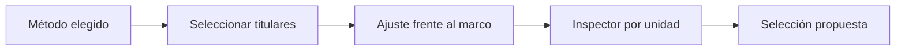

# Cursos-horario titulares
> Genera y revisa la propuesta de unidades titulares con ajuste, probabilidades y razones operativas.
## Objetivo
Cerrar la selección principal de cursos-horario sin perder trazabilidad sobre método, balance y cobertura.
## Antes de empezar
- Elegir un método y revisar su simulación.
- Mantener vigentes la firma del marco y las cuotas objetivo.
## Mapa de la pantalla

## Elementos de la pantalla
| Elemento | Para qué sirve | Qué cambia o produce |
|---|---|---|
| Seleccionar titulares | Ejecuta el selector activo | Crea la muestra principal |
| Indicadores | Resume titulares, reemplazos, calidad y método | Permite decidir si cerrar |
| Ajuste frente al marco | Compara perfil seleccionado y disponible | Detecta brechas |
| Tabla e inspector | Explica inclusión, peso y razones por curso-horario | Aporta trazabilidad operativa |
| Probar reemplazos | Evalúa la reserva asociada | Anticipa contingencias |
## Cómo se usa
1. Genera titulares con el método activo.
2. Revisa calidad representativa, solape y brechas de perfil.
3. Inspecciona probabilidades, pesos y razones de unidades críticas.
4. Repite solo si cambió una decisión del diseño o hay alertas justificadas.
## Resultado y siguiente paso
- Lista titular auditable; continúa con Reemplazos por curso-horario.
## Estados, alertas y límites
- Si no hay selección, la pestaña solo muestra el estado pendiente.
- Regenerar con otra semilla cambia unidades y debe quedar documentado.
- Una buena puntuación global no oculta celdas específicas sin cobertura.

## Cómo interpretar lo que ves

La propuesta titular debe relacionar cada curso con su probabilidad, ajuste, facultad y razón operativa. Seleccionar una unidad no prueba por sí solo que las cuotas queden cubiertas. En **Cursos-horario titulares**, **Seleccionar titulares** fija la entrada o decisión inicial y **Probar reemplazos** muestra el producto que debe ser coherente con ella. Conserva la relación entre el estudiante, el curso-horario y la facultad; una coincidencia en el total no compensa una ruptura en esas unidades.

## Ejemplo guiado

**Propuesta hipotética.** El sorteo produce 18 titulares; todos cumplen cantidad, pero dos facultades quedan con ajuste negativo y un curso posee peso extremo.

**Inspección.** Ejecuta **Seleccionar titulares**, revisa **Indicadores** y abre la fila problemática en **Tabla e inspector**. Contrasta **Ajuste frente al marco** antes de aceptar; reserva **Probar reemplazos** para evaluar contingencias, no para ocultar el desbalance.

**Producto.** Lista titular con probabilidades, pesos y razones operativas visibles para cada curso-horario.

## Si algo no coincide

Si un titular no pertenece al marco firmado, invalida la propuesta y revisa firma, filtros y semilla antes de continuar. Registra los valores observados en **Seleccionar titulares** y **Probar reemplazos**, junto con la versión del marco y los parámetros activos. No corrijas una tabla o salida por separado: vuelve a la entrada causal y recalcula lo que dependa de ella.

## Ubicación en la jerarquía

- Padre: [[Selección]].

