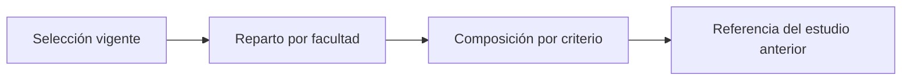

# Perfil de la muestra
> En la UI: **Perfil de la muestra**. De qué está hecha la selección que va a campo.
## Objetivo
Describir la muestra seleccionada facultad por facultad —cuántas aulas, cuántos elegibles y de qué tipo son— para preparar el operativo.
## Antes de empezar
- Correr la selección en Cursos-horario titulares.
## Mapa de la pantalla

## Elementos de la pantalla
| Elemento | Para qué sirve | Qué cambia o produce |
|---|---|---|
| Reparto por facultad | Cuántas aulas y elegibles por facultad | Dimensiona el esfuerzo de cada una |
| Composición por criterio | Qué tipo de aulas le tocó a cada facultad | Anticipa cómo trabajarlas |
| Marca del marco | Dónde caería el corte con la composición del marco | Señala desviaciones |
| Lectura del año pasado | Qué esperar de estas aulas | Da orden de magnitud, no promesa |
## Cómo se usa
1. Corre la selección en Cursos-horario titulares.
2. Revisa cuántas aulas y elegibles le tocaron a cada facultad.
3. Abre los criterios para ver si alguna concentra un tipo de aula atípico.
4. Contrasta con el estudio anterior si el proyecto lo declara.
## Resultado y siguiente paso
- Muestra caracterizada; sigue Reemplazos por curso-horario.
## Estados, alertas y límites
- Aquí no hay asistencia ni efectividad: eso todavía no ocurrió.
- Un criterio con una sola categoría no se dibuja: no describe nada.

## Cómo interpretar lo que ves

Aulas y elegibles no van juntos. Una facultad con pocas aulas puede aportar muchos elegibles si las suyas son grandes, y eso cambia el orden en que conviene trabajarlas. La composición por criterio responde una pregunta distinta a la del diagnóstico de representatividad: aquí no se juzga si la muestra se parece al marco, sino de qué está hecha.

## Ejemplo guiado

**Señal.** Una facultad concentra talleres pequeños mientras el resto tiene clases teóricas grandes.

**Resolución.** Revisa su reparto por tamaño y por tipo de sesión, y ajusta la expectativa de encuestas por visita antes de planificar el campo.

**Evidencia final.** El plan operativo distingue esa facultad del resto.

## Si algo no coincide

Si la composición se aleja mucho de la marca del marco, vuelve a Comparar métodos antes de dar la selección por buena: puede ser el método y no el azar.

## Ubicación en la jerarquía

- Padre: [[Selección]].
