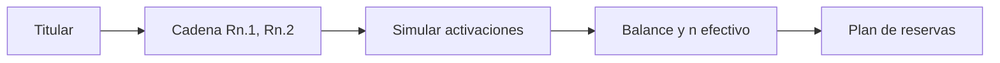

# Reemplazos por curso-horario
> Construye cadenas ordenadas de reserva y simula su efecto antes del trabajo de campo.
## Objetivo
Preparar reemplazos equivalentes por titular para responder a caídas sin rediseñar silenciosamente la muestra.
## Antes de empezar
- Tener cursos-horario titulares seleccionados.
- Definir profundidad de reserva y celdas de equivalencia.
## Mapa de la pantalla

## Elementos de la pantalla
| Elemento | Para qué sirve | Qué cambia o produce |
|---|---|---|
| Profundidad por celda | Detecta reservas insuficientes | Señala celdas sin respaldo |
| Cadenas ordenadas | Asocia cada titular con reservas comparables | Define prioridad de activación |
| Simular reemplazos | Prueba caídas, balance y repetidos | Estima impacto operativo |
| Tablas de impacto | Expone brechas y tamaño efectivo | Sustenta ajustes previos al cierre |
## Cómo se usa
1. Revisa la profundidad mínima y las celdas sin reserva.
2. Comprueba que cada cadena mantiene facultad y perfil relevante.
3. Simula reemplazos en el orden propuesto.
4. Ajusta profundidad o marco si el impacto supera los límites aceptables.
## Resultado y siguiente paso
- Plan ordenado de reservas; continúa con Sustento técnico.
## Estados, alertas y límites
- Una reserva solo se activa si cae su titular; no suma al n objetivo.
- Elegir reemplazos de forma arbitraria rompe probabilidades y balance.
- El seguimiento registra la causa de activación, pero no rediseña el marco.

## Cómo interpretar lo que ves

Un reemplazo es una reserva ordenada para un titular o grupo compatible; no es una unidad intercambiable libremente. La cadena debe conservar facultad, perfil y razón de prioridad. En **Reemplazos por curso-horario**, **Profundidad por celda** fija la entrada o decisión inicial y **Tablas de impacto** muestra el producto que debe ser coherente con ella. Conserva la relación entre el estudiante, el curso-horario y la facultad; una coincidencia en el total no compensa una ruptura en esas unidades.

## Ejemplo guiado

**Incidencia simulada.** Un titular de Ingeniería se cae y su primera reserva pertenece a otra facultad, aunque la segunda comparte celda y horario compatible.

**Sustitución.** Examina **Cadenas ordenadas**, respeta **Profundidad por celda** y ejecuta **Simular reemplazos** con la segunda reserva. Revisa **Tablas de impacto** para confirmar que cuota y pesos no se deterioran.

**Resultado.** Una cadena auditable que conserva prioridad y compatibilidad; la reserva usada queda asociada al titular que reemplaza.

## Si algo no coincide

Si dos titulares comparten la misma primera reserva, revisa la política de exclusividad y vuelve a generar cadenas antes del trabajo de campo. Registra los valores observados en **Profundidad por celda** y **Tablas de impacto**, junto con la versión del marco y los parámetros activos. No corrijas una tabla o salida por separado: vuelve a la entrada causal y recalcula lo que dependa de ella.

## Ubicación en la jerarquía

- Padre: [[Selección]].
