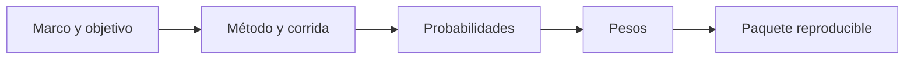

# Sustento técnico
> Reúne fórmulas, métricas y sellos necesarios para reproducir y defender la selección.
## Objetivo
Explicar cómo se midió el ajuste, de dónde salen probabilidades y pesos, y con qué configuración se sorteó.
## Antes de empezar
- Ejecutar la comparación, la simulación y la selección final.
- Conservar la firma del marco y la semilla usadas.
## Mapa de la pantalla

## Elementos de la pantalla
| Elemento | Para qué sirve | Qué cambia o produce |
|---|---|---|
| Fórmula de brecha | Compara porcentaje de muestra y marco | Sustenta el ajuste de perfil |
| Probabilidad de inclusión | Expone pi final y su fuente | Permite reconstruir ponderadores |
| Peso del curso-horario | Usa el inverso de la probabilidad | Define contribución analítica |
| Sello reproducible | Registra semilla, firma, fecha del marco, método y corrida | Permite replicar el sorteo |
| Control de vigencia | Compara la firma actual con la usada por la selección | Invalida titulares y reemplazos desactualizados |
| Corridas Monte Carlo | Documenta la auditoría empírica | Respalda probabilidades simuladas |
## Cómo se usa
1. Revisa las fórmulas con valores reales del estudio.
2. Confirma la fuente de probabilidad reportada.
3. Comprueba por separado la firma usada por la selección, la firma del marco
   actual y la fecha de generación del marco actual, además de semilla, método
   y corrida.
4. Si la firma actual difiere de la usada por la selección, vuelve a comparar métodos y a seleccionar antes de continuar.
5. Conserva estos datos y el respaldo metodológico junto con las tablas finales.
## Resultado y siguiente paso
- Sustento reproducible de la selección; continúa con Cierre de muestra universitaria.
## Estados, alertas y límites
- Sin selección, las fórmulas no pueden mostrar valores validados.
- Peso y probabilidad deben corresponder a la misma corrida y unidad.
- Una firma actual distinta de la firma usada en la selección invalida titulares y reemplazos; Sustento muestra ambos sellos y exige recalcular.
- La fecha de generación pertenece al marco, no a la corrida de selección.
- El respaldo «De la muestra de personas a la lista de cursos-horario» conserva la justificación trazable de conversión, sorteo y reemplazos.

## Cómo interpretar lo que ves

El sustento reúne fórmula, parámetros, firma del marco, método, semilla, probabilidades y métricas. Debe permitir que otra persona reconstruya el diseño sin depender de la pantalla abierta. En **Sustento técnico**, **Fórmula de brecha** fija la entrada o decisión inicial y **Corridas Monte Carlo** muestra el producto que debe ser coherente con ella. Conserva la relación entre el estudiante, el curso-horario y la facultad; una coincidencia en el total no compensa una ruptura en esas unidades.

## Ejemplo guiado

**Falla documental.** La selección puede verse en pantalla, pero el informe carece de semilla y del sello que identifica el marco.

**Reconstrucción.** Verifica **Fórmula de brecha**, **Probabilidad de inclusión**, **Peso del curso-horario** y **Corridas Monte Carlo**. Añade el **Sello reproducible** correspondiente a la ejecución activa; no mezcles métricas de corridas anteriores.

**Entregable.** Un sustento que permite repetir el sorteo y explicar fórmulas, probabilidades, pesos, firma y simulación sin depender de memoria del analista.

## Si algo no coincide

Si una métrica no coincide con la pestaña que la originó, compara versiones y regenera el sustento; no mezcles fragmentos de ejecuciones distintas. Registra los valores observados en **Fórmula de brecha** y **Corridas Monte Carlo**, junto con la versión del marco y los parámetros activos. No corrijas una tabla o salida por separado: vuelve a la entrada causal y recalcula lo que dependa de ella.

## Ubicación en la jerarquía

- Padre: [[Selección]].
