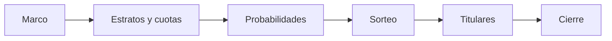

# Relato
> La corrida contada escena por escena: cómo el marco se volvió sorteo y qué probabilidad quedó publicada.
## Objetivo
Poder defender la selección ante un comité mostrando el proceso, no solo su resultado. Las tablas de Titulares y Sustento son correctas pero mudas sobre cómo se llegó a ellas.
## Antes de empezar
- Haber ejecutado una selección: el relato narra la corrida registrada, no una simulación ilustrativa.
- Tener el marco vigente en memoria; sin él, las escenas declaran lo que no pueden mostrar en vez de dibujar un marco inventado.
## Mapa de la pantalla

## Elementos de la pantalla
| Elemento | Para qué sirve | Qué cambia o produce |
|---|---|---|
| Escena «Marco» | Muestra de qué universo se partió | Fija el denominador de todo lo que sigue |
| Escena «Estratos y cuotas» | Cómo el marco se repartió | Explica por qué cada estrato recibió lo que recibió |
| Escena «Probabilidades» | Qué π le tocó a cada curso-horario | Es la cifra que pondera cualquier estimación posterior |
| Escena «Sorteo» | El mecanismo que efectivamente sorteó | Distingue el diseño nominal del ejecutado |
| Escena «Titulares» | Qué unidades quedaron seleccionadas | Enlaza con la pestaña Cursos-horario titulares |
| Escena «Cierre» | Resume la corrida completa | Deja el relato citable |
## Cómo se usa
1. Ejecuta la selección desde Comparar métodos o Simulación.
2. Recorre las seis escenas en el orden del motor (ADR 0058): el orden no es narrativo, es el del cálculo.
3. Contrasta la probabilidad narrada con la publicada en Sustento técnico.
## Resultado y siguiente paso
- Una narración trazable de la corrida; continúa con Sustento técnico para el respaldo formal.
## Estados, alertas y límites
- Cada cuadro es un hecho de la corrida real; cuando un dato no viajó, la escena lo declara como hueco en vez de rellenarlo.
- Con engine balanceado el sorteo se resuelve de una vez y la escena lo dice: no hay una secuencia de extracciones que mostrar.
- El relato no recalcula ni corrige: si una cifra no cuadra, el problema está en la corrida, no en su narración.

## Ubicación en la jerarquía

- Padre: [[Selección]].
- Decisión que lo gobierna: ADR 0067, extensión narrativa del ADR 0066 (la probabilidad publicada es la del sorteo ejecutado).
