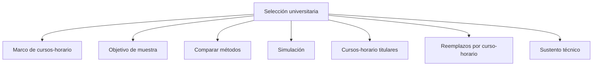

# Selección

> En la UI: **Selección**. Convierte cuotas en cursos-horario titulares, reemplazos y evidencia técnica.

## Propósito de esta guía

**Selección universitaria** organiza decisiones que cambian el diseño muestral y sus salidas. En la UI: **Selección**. Convierte cuotas en cursos-horario titulares, reemplazos y evidencia técnica. Cada vínculo de esta página conduce exclusivamente a un hijo directo y explica qué pregunta resuelve, qué debe comprobarse allí y qué evidencia queda preparada.

## Antes de recorrer este nivel

Trabaja con las bases de estudiantes y cursos-horario del mismo periodo académico. Conserva las llaves que los relacionan y verifica que facultad, sexo, nivel, sección y tamaño de curso procedan de las columnas asignadas. En **Selección universitaria**, confirma siempre que población, marco, parámetros y resultados pertenezcan a la misma versión. Si cambia una fuente, una regla de elegibilidad, una cuota o la semilla, deja de ser válida cualquier selección o salida anterior que dependa de ese dato.

## Mapa de navegación

## Guía de destinos

| Destino | Cuándo entrar | Qué hacer allí | Qué deja listo |
|---|---|---|---|
| [[Marco de cursos-horario]] | cuando el marco definitivo debe congelarse antes de ejecutar cualquier selector. | En la UI: **Marco de aulas**. Congela las unidades seleccionables y deja una firma reproducible antes del sorteo. | firma reproducible del marco de cursos-horario. |
| [[Objetivo de muestra]] | cuando cuotas y marco están aprobados y debes fijar titulares, reservas y parámetros del selector. | Traduce las cuotas de estudiantes en titulares, reservas y parámetros técnicos para seleccionar cursos-horario. | objetivo operativo de selección. |
| [[Comparar métodos]] | cuando debes elegir entre PPS, cubo balanceado, pivotal local y pool controlado con métricas comunes. | Evalúa cuatro selectores probabilísticos o auditables y recomienda uno con métricas del marco vigente. | método de selección elegido y justificado. |
| [[Simulación]] | cuando el método necesita una prueba de estabilidad, probabilidades de inclusión y dispersión de pesos. | Repite el selector para estimar estabilidad, probabilidades de inclusión y dispersión de pesos. | diagnóstico Monte Carlo del selector. |
| [[Cursos-horario titulares]] | cuando método, marco y objetivo están cerrados y corresponde generar la propuesta principal. | Genera y revisa la propuesta de unidades titulares con ajuste, probabilidades y razones operativas. | lista de cursos-horario titulares con probabilidades y razones. |
| [[Reemplazos por curso-horario]] | cuando los titulares necesitan reservas compatibles y ordenadas antes del campo. | Construye cadenas ordenadas de reserva y simula su efecto antes del trabajo de campo. | cadenas de reserva y su impacto simulado. |
| [[Sustento técnico]] | cuando la selección debe poder reproducirse y defenderse fuera de la aplicación. | Reúne fórmulas, métricas y sellos necesarios para reproducir y defender la selección. | sustento técnico con fórmulas, firma, semilla y métricas. |

## Recorrido recomendado

1. **Marco de cursos-horario:** En la UI: **Marco de aulas**. Congela las unidades seleccionables y deja una firma reproducible antes del sorteo; al terminar, el resultado es firma reproducible del marco de cursos-horario.
2. **Objetivo de muestra:** Traduce las cuotas de estudiantes en titulares, reservas y parámetros técnicos para seleccionar cursos-horario; al terminar, el resultado es objetivo operativo de selección.
3. **Comparar métodos:** Evalúa cuatro selectores probabilísticos o auditables y recomienda uno con métricas del marco vigente; al terminar, el resultado es método de selección elegido y justificado.
4. **Simulación:** Repite el selector para estimar estabilidad, probabilidades de inclusión y dispersión de pesos; al terminar, el resultado es diagnóstico Monte Carlo del selector.
5. **Cursos-horario titulares:** Genera y revisa la propuesta de unidades titulares con ajuste, probabilidades y razones operativas; al terminar, el resultado es lista de cursos-horario titulares con probabilidades y razones.
6. **Reemplazos por curso-horario:** Construye cadenas ordenadas de reserva y simula su efecto antes del trabajo de campo; al terminar, el resultado es cadenas de reserva y su impacto simulado.
7. **Sustento técnico:** Reúne fórmulas, métricas y sellos necesarios para reproducir y defender la selección; al terminar, el resultado es sustento técnico con fórmulas, firma, semilla y métricas.

La primera configuración debe seguir ese orden: los insumos delimitan lo seleccionable; el método transforma esos insumos en metas o probabilidades; y el cierre conserva la evidencia. En **Selección universitaria**, empieza por **Marco de cursos-horario** y termina en **Sustento técnico**. Para una revisión puntual puedes abrir directamente el destino causal, pero recalcula las tareas posteriores si modificas su entrada.

## Cómo interpretar avance y estados

En **Selección universitaria**, **sin configurar** indica que falta una entrada indispensable; **no evaluado** significa que la entrada existe pero el cálculo aún no se ejecutó; **listo** exige resultados ligados a la versión actual; **requiere atención** señala una inconsistencia concreta. Un valor cero es un resultado numérico y no reemplaza a “sin dato”. En tablas, conserva denominadores, filtros y totales al pasar del resumen al detalle.

## Resultado de este nivel

Al completar **Selección universitaria** quedan visibles los supuestos utilizados, las decisiones que transforman el marco y la evidencia necesaria para reproducir el resultado. Antes de entregar o transferir el diseño, comprueba que nombres, firmas, semillas, totales y fechas correspondan a la misma versión.

## Ubicación en la jerarquía

- Padre: [[Muestra de cursos-horario]].

