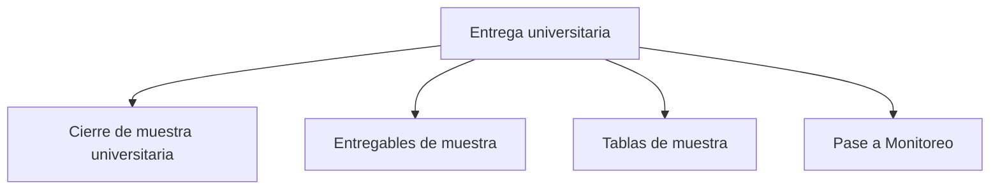

# Entrega

> En la UI: **Entrega**. Cierra el diseño, publica salidas y entrega el plan a Monitoreo.

## Propósito de esta guía

**Entrega universitaria** organiza decisiones que cambian el diseño muestral y sus salidas. En la UI: **Entrega**. Cierra el diseño, publica salidas y entrega el plan a Monitoreo. Cada vínculo de esta página conduce exclusivamente a un hijo directo y explica qué pregunta resuelve, qué debe comprobarse allí y qué evidencia queda preparada.

## Antes de recorrer este nivel

Trabaja con las bases de estudiantes y cursos-horario del mismo periodo académico. Conserva las llaves que los relacionan y verifica que facultad, sexo, nivel, sección y tamaño de curso procedan de las columnas asignadas. En **Entrega universitaria**, confirma siempre que población, marco, parámetros y resultados pertenezcan a la misma versión. Si cambia una fuente, una regla de elegibilidad, una cuota o la semilla, deja de ser válida cualquier selección o salida anterior que dependa de ese dato.

## Mapa de navegación

## Guía de destinos

| Destino | Cuándo entrar | Qué hacer allí | Qué deja listo |
|---|---|---|---|
| [[Cierre de muestra universitaria]] | cuando marco, cálculo y selección están completos y debes comprobar su coherencia conjunta. | Resume la salud del diseño y verifica el camino desde el marco validado hasta los entregables. | diagnóstico de cierre de la muestra. |
| [[Entregables de muestra]] | cuando el diseño está cerrado y debes definir audiencia, privacidad y destino de publicación. | Configura el paquete de defensa, la política de privacidad y los destinos Excel o Google Sheets. | paquete de entregables configurado. |
| [[Tablas de muestra]] | cuando necesitas revisar o compartir la distribución final por componente. | Presenta la distribución validada del motor y las tablas de cierre por componente. | tablas de cierre validadas. |
| [[Pase a Monitoreo]] | cuando titulares, reservas, códigos y pesos están cerrados para iniciar seguimiento de campo. | Prepara la agenda cerrada de titulares, reservas, códigos y pesos para el seguimiento de campo. | agenda muestral transferible a Monitoreo. |

## Recorrido recomendado

1. **Cierre de muestra universitaria:** Resume la salud del diseño y verifica el camino desde el marco validado hasta los entregables; al terminar, el resultado es diagnóstico de cierre de la muestra.
2. **Entregables de muestra:** Configura el paquete de defensa, la política de privacidad y los destinos Excel o Google Sheets; al terminar, el resultado es paquete de entregables configurado.
3. **Tablas de muestra:** Presenta la distribución validada del motor y las tablas de cierre por componente; al terminar, el resultado es tablas de cierre validadas.
4. **Pase a Monitoreo:** Prepara la agenda cerrada de titulares, reservas, códigos y pesos para el seguimiento de campo; al terminar, el resultado es agenda muestral transferible a Monitoreo.

La primera configuración debe seguir ese orden: los insumos delimitan lo seleccionable; el método transforma esos insumos en metas o probabilidades; y el cierre conserva la evidencia. En **Entrega universitaria**, empieza por **Cierre de muestra universitaria** y termina en **Pase a Monitoreo**. Para una revisión puntual puedes abrir directamente el destino causal, pero recalcula las tareas posteriores si modificas su entrada.

## Cómo interpretar avance y estados

En **Entrega universitaria**, **sin configurar** indica que falta una entrada indispensable; **no evaluado** significa que la entrada existe pero el cálculo aún no se ejecutó; **listo** exige resultados ligados a la versión actual; **requiere atención** señala una inconsistencia concreta. Un valor cero es un resultado numérico y no reemplaza a “sin dato”. En tablas, conserva denominadores, filtros y totales al pasar del resumen al detalle.

## Resultado de este nivel

Al completar **Entrega universitaria** quedan visibles los supuestos utilizados, las decisiones que transforman el marco y la evidencia necesaria para reproducir el resultado. Antes de entregar o transferir el diseño, comprueba que nombres, firmas, semillas, totales y fechas correspondan a la misma versión.

## Ubicación en la jerarquía

- Padre: [[Muestra de cursos-horario]].
