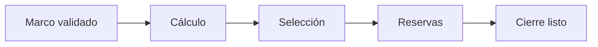

# Cierre de muestra universitaria
> Resume la salud del diseño y verifica el camino desde el marco validado hasta los entregables.
## Objetivo
Decidir si cálculo, selección y reservas están suficientemente completos para emitir una salida.
## Antes de empezar
- Completar la propuesta calculada, la selección titular y el plan de reemplazos.
- Resolver alertas metodológicas pendientes.
## Mapa de la pantalla

## Elementos de la pantalla
| Elemento | Para qué sirve | Qué cambia o produce |
|---|---|---|
| Ficha ejecutiva | Resume decisiones y estados | Facilita la revisión final |
| Camino de cierre | Muestra avance por etapa | Identifica el primer pendiente |
| Cifras de defensa | Expone n, margen, representatividad y titulares | Sustenta la aprobación |
| Sello del sorteo | Conserva configuración reproducible | Vincula cierre y selección |
| Observaciones | Presenta alertas de salud | Impide cerrar sin revisar riesgos |
## Cómo se usa
1. Recorre los estados del camino completo.
2. Contrasta n objetivo, margen real y representatividad.
3. Revisa titulares, profundidad de reserva y sello del sorteo.
4. Resuelve observaciones antes de configurar salidas.
## Resultado y siguiente paso
- Diseño revisado y listo para salida; continúa con Entregables de muestra.
## Estados, alertas y límites
- Configurar un destino no compensa un cálculo o selección pendiente.
- Las observaciones críticas requieren una decisión explícita.
- El cierre resume evidencia; no altera la muestra.

## Cómo interpretar lo que ves

Cerrar y publicar son decisiones distintas. El cierre verifica coherencia; las tablas exponen la distribución; los entregables aplican audiencia y privacidad; el pase operativo transfiere titulares, reservas, códigos y pesos. En **Cierre de muestra universitaria**, **Ficha ejecutiva** fija la entrada o decisión inicial y **Observaciones** muestra el producto que debe ser coherente con ella. Conserva la relación entre el estudiante, el curso-horario y la facultad; una coincidencia en el total no compensa una ruptura en esas unidades.

## Ejemplo guiado

**Chequeo previo.** La ficha ejecutiva muestra 20 titulares, pero el sello del sorteo corresponde a una versión con 18 y quedan observaciones abiertas.

**Ruta de cierre.** Sigue **Camino de cierre**, contrasta **Cifras de defensa** con la selección y verifica **Sello del sorteo**. Resuelve **Observaciones** antes de aprobar la **Ficha ejecutiva**.

**Estado final.** Diagnóstico de coherencia cerrado: marco, objetivo, titulares, reservas y evidencia pertenecen a una sola ejecución.

## Si algo no coincide

Si Monitoreo recibe unidades distintas a las tablas, compara identificador de versión, firma y fecha; invalida el pase anterior después de cualquier recálculo. Registra los valores observados en **Ficha ejecutiva** y **Observaciones**, junto con la versión del marco y los parámetros activos. No corrijas una tabla o salida por separado: vuelve a la entrada causal y recalcula lo que dependa de ella.

## Ubicación en la jerarquía

- Padre: [[Entrega]].

