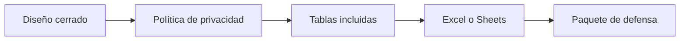

# Entregables de muestra
> Configura el paquete de defensa, la política de privacidad y los destinos Excel o Google Sheets.
## Objetivo
Generar salidas útiles para cliente y equipo interno sin publicar identificadores innecesarios.
## Antes de empezar
- Tener cálculo y selección listos.
- Definir quién recibirá cada entregable y qué nivel de detalle necesita.
## Mapa de la pantalla

## Elementos de la pantalla
| Elemento | Para qué sirve | Qué cambia o produce |
|---|---|---|
| Checklist del paquete | Comprueba piezas metodológicas | Habilita una salida defendible |
| Matriz de privacidad | Distingue columnas para cliente e internas | Excluye PII y códigos sensibles |
| Excel local | Genera un libro de trabajo sin internet | Reúne tablas en un archivo |
| Google Sheets | Prepara publicación compartida | Organiza varias hojas en línea |
| Configuración de tablas | Define nombres y contenidos | Ajusta el paquete emitido |
## Cómo se usa
1. Revisa el checklist del paquete de defensa.
2. Elige política de identificadores según destinatario.
3. Confirma tablas y columnas incluidas.
4. Configura Excel local o Google Sheets y genera la salida.
## Resultado y siguiente paso
- Paquete configurado o generado; continúa con Pase a Monitoreo.
## Estados, alertas y límites
- Las salidas para cliente no incluyen códigos de estudiante.
- Google Sheets requiere un destino válido y conectividad.
- Un entregable queda desactualizado si cambia el diseño después de generarlo.

## Cómo interpretar lo que ves

Cerrar y publicar son decisiones distintas. El cierre verifica coherencia; las tablas exponen la distribución; los entregables aplican audiencia y privacidad; el pase operativo transfiere titulares, reservas, códigos y pesos. En **Entregables de muestra**, **Checklist del paquete** fija la entrada o decisión inicial y **Configuración de tablas** muestra el producto que debe ser coherente con ella. Conserva la relación entre el estudiante, el curso-horario y la facultad; una coincidencia en el total no compensa una ruptura en esas unidades.

## Ejemplo guiado

**Solicitud.** El equipo interno necesita probabilidades y pesos; el cliente sólo debe recibir cursos seleccionados sin identificadores sensibles.

**Configuración.** Marca contenidos en **Checklist del paquete**, aplica la **Matriz de privacidad** y separa **Excel local** de **Google Sheets**. Ajusta **Configuración de tablas** según audiencia antes de generar archivos.

**Producto.** Dos paquetes distintos y rotulados, cada uno con alcance y protección adecuados, derivados del mismo diseño cerrado.

## Si algo no coincide

Si Monitoreo recibe unidades distintas a las tablas, compara identificador de versión, firma y fecha; invalida el pase anterior después de cualquier recálculo. Registra los valores observados en **Checklist del paquete** y **Configuración de tablas**, junto con la versión del marco y los parámetros activos. No corrijas una tabla o salida por separado: vuelve a la entrada causal y recalcula lo que dependa de ella.

## Ubicación en la jerarquía

- Padre: [[Entrega]].
