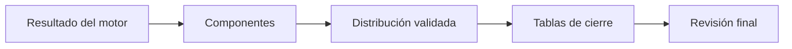

# Tablas de muestra
> Presenta la distribución validada del motor y las tablas de cierre por componente.
## Objetivo
Revisar en formato tabular las metas, cuotas y procedencia de los resultados antes del pase operativo.
## Antes de empezar
- Ejecutar el cálculo y validar una propuesta.
- Mantener actualizados componentes y cuotas del estudio.
## Mapa de la pantalla

## Elementos de la pantalla
| Elemento | Para qué sirve | Qué cambia o produce |
|---|---|---|
| Resumen por componente | Separa actores o poblaciones | Ordena la lectura del diseño |
| Distribución validada | Muestra cuotas emitidas por el motor | Evita recalcular cifras en la interfaz |
| Totales | Permite verificar sumas | Detecta inconsistencias |
| Procedencia | Indica origen de cada tabla | Distingue motor, marco y configuración |
## Cómo se usa
1. Revisa cada componente del estudio.
2. Contrasta cuotas y totales con la propuesta activa.
3. Verifica la procedencia de las cifras.
4. Corrige el cálculo si una tabla no representa el diseño aprobado.
## Resultado y siguiente paso
- Tablas validadas; continúa con Pase a Monitoreo.
## Estados, alertas y límites
- Sin resultado calculado no hay distribución validada.
- Las tablas muestran el resultado; no son un editor alternativo de cuotas.
- Cualquier cambio posterior exige regenerar las salidas.

## Cómo interpretar lo que ves

Cerrar y publicar son decisiones distintas. El cierre verifica coherencia; las tablas exponen la distribución; los entregables aplican audiencia y privacidad; el pase operativo transfiere titulares, reservas, códigos y pesos. En **Tablas de muestra**, **Resumen por componente** fija la entrada o decisión inicial y **Procedencia** muestra el producto que debe ser coherente con ella. Conserva la relación entre el estudiante, el curso-horario y la facultad; una coincidencia en el total no compensa una ruptura en esas unidades.

## Ejemplo guiado

**Control tabular hipotético.** El resumen declara 24 cursos, pero los componentes por facultad suman 23 debido a una categoría vacía.

**Auditoría.** Abre **Resumen por componente**, compara **Distribución validada** y verifica **Totales**. Usa **Procedencia** para rastrear la fila sin facultad hasta el marco o el mapeo; no edites la exportación para cuadrarla.

**Resultado.** Tablas consistentes con el motor o una discrepancia causal identificada antes de publicar.

## Si algo no coincide

Si Monitoreo recibe unidades distintas a las tablas, compara identificador de versión, firma y fecha; invalida el pase anterior después de cualquier recálculo. Registra los valores observados en **Resumen por componente** y **Procedencia**, junto con la versión del marco y los parámetros activos. No corrijas una tabla o salida por separado: vuelve a la entrada causal y recalcula lo que dependa de ella.

## Ubicación en la jerarquía

- Padre: [[Entrega]].

