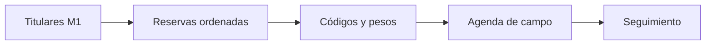

# Pase a Monitoreo
> Prepara la agenda cerrada de titulares, reservas, códigos y pesos para el seguimiento de campo.
## Objetivo
Entregar un plan operativo trazable sin permitir que el seguimiento rediseñe la muestra.
## Antes de empezar
- Cerrar titulares y cadenas de reemplazo.
- Revisar el paquete metodológico y las tablas finales.
## Mapa de la pantalla

## Elementos de la pantalla
| Elemento | Para qué sirve | Qué cambia o produce |
|---|---|---|
| Resumen del pase | Explica qué recibe el seguimiento | Delimita responsabilidades |
| Indicadores | Cuenta titulares y reemplazos | Confirma volumen operativo |
| Plan de cursos-horario | Lista curso, horario, salón y trazabilidad | Alimenta fichas y agenda |
| Reservas por celda | Muestra profundidad disponible | Prepara activaciones justificadas |
| Acción de apertura | Lleva al seguimiento operativo | Inicia la gestión de campo |
## Cómo se usa
1. Confirma método, titulares y reservas cerrados.
2. Revisa códigos, pesos y profundidad por celda.
3. Emite el plan para fichas QR o PDF y agenda.
4. Abre Monitoreo para registrar avance y activaciones.
## Resultado y siguiente paso
- Agenda muestral cerrada; el siguiente paso es el seguimiento en Monitoreo.
## Estados, alertas y límites
- Sin selección no puede emitirse el plan de cursos-horario.
- Monitoreo activa reservas y registra motivos; no cambia el diseño base.
- Toda sustitución debe conservar su cadena y trazabilidad.

## Cómo interpretar lo que ves

Cerrar y publicar son decisiones distintas. El cierre verifica coherencia; las tablas exponen la distribución; los entregables aplican audiencia y privacidad; el pase operativo transfiere titulares, reservas, códigos y pesos. En **Pase a Monitoreo**, **Resumen del pase** fija la entrada o decisión inicial y **Acción de apertura** muestra el producto que debe ser coherente con ella. Conserva la relación entre el estudiante, el curso-horario y la facultad; una coincidencia en el total no compensa una ruptura en esas unidades.

## Ejemplo guiado

**Traspaso detenido.** La selección está cerrada, aunque tres reservas carecen de código operativo y el plan no puede construir su agenda.

**Preparación.** Revisa **Resumen del pase** e **Indicadores**, abre **Reservas por celda** y completa la relación permitida desde el origen. Confirma pesos y códigos en **Plan de cursos-horario** antes de usar **Acción de apertura**.

**Resultado.** Monitoreo recibe titulares y reservas identificables, con celdas, prioridades y pesos coherentes con la muestra aprobada.

## Si algo no coincide

Si Monitoreo recibe unidades distintas a las tablas, compara identificador de versión, firma y fecha; invalida el pase anterior después de cualquier recálculo. Registra los valores observados en **Resumen del pase** y **Acción de apertura**, junto con la versión del marco y los parámetros activos. No corrijas una tabla o salida por separado: vuelve a la entrada causal y recalcula lo que dependa de ella.

## Ubicación en la jerarquía

- Padre: [[Entrega]].
