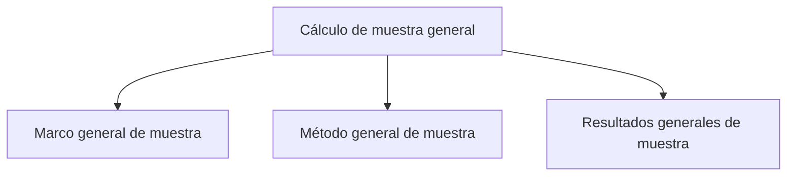

# Muestra general

> Calcula una muestra desde un marco disponible mediante una ruta breve de tres secciones.

## Propósito de esta guía

**Cálculo de muestra general** organiza decisiones que cambian el diseño muestral y sus salidas. Calcula una muestra desde un marco disponible mediante una ruta breve de tres secciones. Cada vínculo de esta página conduce exclusivamente a un hijo directo y explica qué pregunta resuelve, qué debe comprobarse allí y qué evidencia queda preparada.

## Antes de recorrer este nivel

Define población objetivo, unidad de observación, unidad seleccionable y fuente del marco. Un tamaño poblacional sin procedencia no permite defender la corrección finita ni la distribución. En **Cálculo de muestra general**, confirma siempre que población, marco, parámetros y resultados pertenezcan a la misma versión. Si cambia una fuente, una regla de elegibilidad, una cuota o la semilla, deja de ser válida cualquier selección o salida anterior que dependa de ese dato.

## Mapa de navegación

## Guía de destinos

| Destino | Cuándo entrar | Qué hacer allí | Qué deja listo |
|---|---|---|---|
| [[Marco]] | antes de elegir técnica, para declarar población, unidad y fuente del marco. | Delimita población, unidad de observación, fuente y organización del marco para un estudio general. | un marco general auditable y compatible con la técnica. |
| [[Método]] | cuando población y estructura del marco ya están definidas. | Configura la técnica, precisión y restricciones con las que el motor calcula la muestra. | una técnica con precisión, supuestos y restricciones explícitos. |
| [[Resultados]] | después de configurar el método, para ejecutar y revisar el cálculo. | Ejecuta el motor y presenta tamaño, distribución, supuestos y reporte metodológico del diseño general. | tamaño, distribución y reporte metodológico del diseño general. |

## Recorrido recomendado

1. **Marco general de muestra:** Delimita población, unidad de observación, fuente y organización del marco para un estudio general; al terminar, el resultado es un marco general auditable y compatible con la técnica.
2. **Método general de muestra:** Configura la técnica, precisión y restricciones con las que el motor calcula la muestra; al terminar, el resultado es una técnica con precisión, supuestos y restricciones explícitos.
3. **Resultados generales de muestra:** Ejecuta el motor y presenta tamaño, distribución, supuestos y reporte metodológico del diseño general; al terminar, el resultado es tamaño, distribución y reporte metodológico del diseño general.

La primera configuración debe seguir ese orden: los insumos delimitan lo seleccionable; el método transforma esos insumos en metas o probabilidades; y el cierre conserva la evidencia. En **Cálculo de muestra general**, empieza por **Marco general de muestra** y termina en **Resultados generales de muestra**. Para una revisión puntual puedes abrir directamente el destino causal, pero recalcula las tareas posteriores si modificas su entrada.

## Cómo interpretar avance y estados

En **Cálculo de muestra general**, **sin configurar** indica que falta una entrada indispensable; **no evaluado** significa que la entrada existe pero el cálculo aún no se ejecutó; **listo** exige resultados ligados a la versión actual; **requiere atención** señala una inconsistencia concreta. Un valor cero es un resultado numérico y no reemplaza a “sin dato”. En tablas, conserva denominadores, filtros y totales al pasar del resumen al detalle.

## Resultado de este nivel

Al completar **Cálculo de muestra general** quedan visibles los supuestos utilizados, las decisiones que transforman el marco y la evidencia necesaria para reproducir el resultado. Antes de entregar o transferir el diseño, comprueba que nombres, firmas, semillas, totales y fechas correspondan a la misma versión.

## Ubicación en la jerarquía

- Padre: [[Calculador de muestras]].

