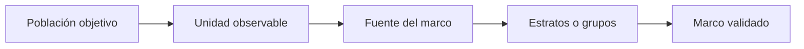

# Marco
> Delimita población, unidad de observación, fuente y organización del marco para un estudio general.
## Objetivo
Describir qué unidades existen y cuáles pueden ser seleccionadas antes de escoger una técnica de muestreo.
## Antes de empezar
- Identificar la población objetivo y la fuente que permite enumerarla.
- Decidir si la base se organiza como total, estratos, conglomerados o cuotas operativas.
## Mapa de la pantalla

## Elementos de la pantalla
| Elemento | Para qué sirve | Qué cambia o produce |
|---|---|---|
| Unidad de observación | Define quién aporta la respuesta | Delimita el universo analítico |
| Unidad seleccionable | Establece qué se sortea | Restringe técnicas compatibles |
| Fuente del marco | Registra procedencia de la población | Aporta trazabilidad |
| Población total | Fija N conocido | Permite corrección finita |
| Estratos o grupos | Describe la estructura disponible | Habilita distribución de muestra |
## Cómo se usa
1. Declara población y unidad de observación.
2. Indica qué unidad puede seleccionarse realmente.
3. Registra la fuente y el tamaño del marco.
4. Añade estratos o grupos cuando existan y valida sus totales.
## Resultado y siguiente paso
- Marco general explícito; el siguiente paso es Método general de muestra.
## Estados, alertas y límites
- Un N declarado sin fuente no constituye un marco auditable.
- Estratos incompletos pueden producir cuotas incoherentes.
- El marco limita la técnica: no todo diseño es posible con cualquier fuente.

## Cómo interpretar lo que ves

Población objetivo, unidad de observación y unidad seleccionable pueden ser distintas. La técnica sólo es defendible si la fuente enumera la unidad que realmente se sortea y si N tiene procedencia. En **Marco general de muestra**, **Unidad de observación** fija la entrada o decisión inicial y **Estratos o grupos** muestra el producto que debe ser coherente con ella. Conserva la relación entre la población, la unidad seleccionable y la fuente del marco; una coincidencia en el total no compensa una ruptura en esas unidades.

## Ejemplo guiado

**Caso general.** El estudio observa personas, pero la fuente sólo enumera hogares; declarar ambos como la misma unidad haría imposible justificar el sorteo.

**Definición.** Separa **Unidad de observación** de **Unidad seleccionable**, registra **Fuente del marco** y valida **Población total** contra **Estratos o grupos**.

**Salida.** Un marco que explica qué entidad se elige, quién responde y qué estructura está disponible para distribuir la muestra.

## Si algo no coincide

Si N declarado no coincide con estratos o grupos, revisa cobertura y duplicados antes de configurar precisión. Registra los valores observados en **Unidad de observación** y **Estratos o grupos**, junto con la versión del marco y los parámetros activos. No corrijas una tabla o salida por separado: vuelve a la entrada causal y recalcula lo que dependa de ella.

## Ubicación en la jerarquía

- Padre: [[Muestra general]].
