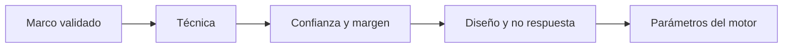

# Método
> Configura la técnica, precisión y restricciones con las que el motor calcula la muestra.
## Objetivo
Elegir un método compatible con el marco y convertir supuestos estadísticos en parámetros reproducibles.
## Antes de empezar
- Validar población, unidad seleccionable y estructura del marco.
- Definir si se necesita inferencia total, por estratos o por dominios independientes.
## Mapa de la pantalla

## Elementos de la pantalla
| Elemento | Para qué sirve | Qué cambia o produce |
|---|---|---|
| Técnica | Elige aleatorio simple, estratificado u otra familia | Determina la fórmula y distribución |
| Confianza | Fija el nivel de cobertura del intervalo | Modifica el tamaño requerido |
| Margen de error | Define precisión objetivo | Modifica n de forma directa |
| Proporción esperada | Representa variabilidad del indicador | Ajusta el caso de diseño |
| Diseño y no respuesta | Añade efectos y contingencia operativa | Incrementa n final |
| Pisos y topes | Restringe cuotas por celda | Controla viabilidad operativa |
## Cómo se usa
1. Elige la técnica compatible con el marco.
2. Configura confianza, margen y proporción esperada.
3. Ajusta efecto de diseño y no respuesta si el diseño lo exige.
4. Revisa pisos, topes y dominios antes de calcular.
## Resultado y siguiente paso
- Parámetros metodológicos listos; el siguiente paso es Resultados generales de muestra.
## Estados, alertas y límites
- Márgenes por dominio requieren tamaños independientes mayores.
- Pisos muy altos pueden superar la población disponible.
- Los ajustes operativos no sustituyen la justificación estadística.

## Cómo interpretar lo que ves

La técnica, confianza, error, corrección finita, efecto de diseño y restricciones determinan el tamaño. Cambiar cualquiera exige recalcular y explicar su efecto. En **Método general de muestra**, **Técnica** fija la entrada o decisión inicial y **Pisos y topes** muestra el producto que debe ser coherente con ella. Conserva la relación entre la población, la unidad seleccionable y la fuente del marco; una coincidencia en el total no compensa una ruptura en esas unidades.

## Ejemplo guiado

**Prueba hipotética.** Con N=4 000, confianza 95% y error 5%, el tamaño parece viable; añadir no respuesta de 20% cambia la carga de campo.

**Secuencia.** Elige **Técnica**, fija **Confianza**, **Margen de error** y **Proporción esperada**; después incorpora **Diseño y no respuesta**. Usa **Pisos y topes** sólo por una restricción documentada.

**Decisión.** Parámetros metodológicos explícitos y un tamaño que no fue ajustado simplemente para coincidir con presupuesto.

## Si algo no coincide

Si el motor acepta una técnica incompatible con la unidad seleccionable, vuelve al marco y corrige la estructura antes de usar el resultado. Registra los valores observados en **Técnica** y **Pisos y topes**, junto con la versión del marco y los parámetros activos. No corrijas una tabla o salida por separado: vuelve a la entrada causal y recalcula lo que dependa de ella.

## Ubicación en la jerarquía

- Padre: [[Muestra general]].
