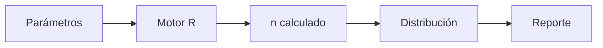

# Resultados
> Ejecuta el motor y presenta tamaño, distribución, supuestos y reporte metodológico del diseño general.
## Objetivo
Validar que el tamaño calculado y sus cuotas responden al marco y a los parámetros aprobados.
## Antes de empezar
- Completar el marco y el método general.
- Resolver incoherencias de población, estratos, pisos o topes.
## Mapa de la pantalla

## Elementos de la pantalla
| Elemento | Para qué sirve | Qué cambia o produce |
|---|---|---|
| Calcular | Envía marco y parámetros al motor | Genera una corrida |
| Resumen | Presenta n base, ajustes y n final | Explica la composición del tamaño |
| Distribución | Muestra cuotas por estrato o dominio | Produce metas operativas |
| Alertas | Señala límites y supuestos incumplidos | Orienta correcciones |
| Reporte | Renderiza el sustento metodológico | Genera una salida reproducible |
## Cómo se usa
1. Ejecuta el cálculo con la configuración vigente.
2. Revisa n base, corrección finita y ajustes aplicados.
3. Verifica que cuotas y totales respetan el marco.
4. Genera el reporte cuando la corrida esté validada.
## Resultado y siguiente paso
- Tamaño y distribución validados; el siguiente paso es usar las metas en la planificación del estudio.
## Estados, alertas y límites
- Cambiar el marco o método deja obsoleta la corrida anterior.
- Redondeos y pisos pueden alterar la suma respecto del n teórico.
- El reporte documenta la corrida; no corrige una configuración inválida.

## Cómo interpretar lo que ves

El tamaño total debe leerse junto con distribución y supuestos. Un reporte metodológico válido conserva población, técnica, parámetros, redondeos y restricciones usados por el motor. En **Resultados generales de muestra**, **Calcular** fija la entrada o decisión inicial y **Reporte** muestra el producto que debe ser coherente con ella. Conserva la relación entre la población, la unidad seleccionable y la fuente del marco; una coincidencia en el total no compensa una ruptura en esas unidades.

## Ejemplo guiado

**Anomalía hipotética.** El motor calcula 360 casos, pero un estrato recibe 4 cuando el mínimo operativo declarado es 10.

**Revisión.** Pulsa **Calcular**, compara **Resumen** con **Distribución** y abre **Alertas** del estrato. Si corregir el mínimo cambia total o precisión, vuelve al método y ejecuta nuevamente.

**Cierre.** **Reporte** presenta tamaño, asignación, redondeos y advertencias de la misma corrida, sin correcciones manuales posteriores.

## Si algo no coincide

Si reporte y pantalla difieren, compara la versión de parámetros y vuelve a ejecutar; no edites la tabla exportada para hacerla coincidir. Registra los valores observados en **Calcular** y **Reporte**, junto con la versión del marco y los parámetros activos. No corrijas una tabla o salida por separado: vuelve a la entrada causal y recalcula lo que dependa de ella.

## Ubicación en la jerarquía

- Padre: [[Muestra general]].
