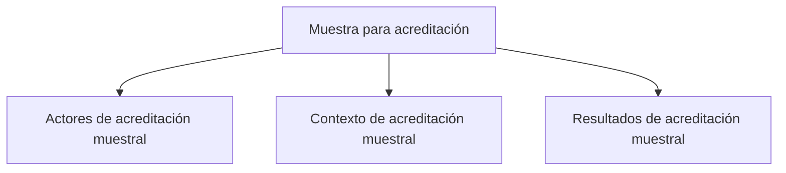

# Acreditación

> Define metas separadas por actor y canal dentro de un estudio de acreditación.

## Propósito de esta guía

**Muestra para acreditación** organiza decisiones que cambian el diseño muestral y sus salidas. Define metas separadas por actor y canal dentro de un estudio de acreditación. Cada vínculo de esta página conduce exclusivamente a un hijo directo y explica qué pregunta resuelve, qué debe comprobarse allí y qué evidencia queda preparada.

## Antes de recorrer este nivel

Confirma el alcance del proceso y separa estudiantes, docentes, administrativos u otros actores sólo cuando tengan población, canal y regla propios. Una meta operativa no equivale por sí sola a precisión inferencial. En **Muestra para acreditación**, confirma siempre que población, marco, parámetros y resultados pertenezcan a la misma versión. Si cambia una fuente, una regla de elegibilidad, una cuota o la semilla, deja de ser válida cualquier selección o salida anterior que dependa de ese dato.

## Mapa de navegación

## Guía de destinos

| Destino | Cuándo entrar | Qué hacer allí | Qué deja listo |
|---|---|---|---|
| [[Actores]] | al delimitar quién debe estar representado en el proceso de acreditación. | Organiza el universo institucional en actores y componentes con metas, canales y reglas propias. | actores y componentes con metas, canales, pisos y topes. |
| [[Contexto]] | cuando cada actor necesita población, fuente y parámetros interpretables. | Completa programa, fuente, estructura del marco y parámetros que dan sentido a cada actor. | un contexto de cálculo completo por componente institucional. |
| [[Resultados]] | cuando actores y contexto están listos para calcular metas y revisar el cierre. | Calcula metas por actor y presenta el cierre metodológico del conjunto de componentes institucionales. | resultados separados por actor y un sustento metodológico conjunto. |

## Recorrido recomendado

1. **Actores de acreditación muestral:** Organiza el universo institucional en actores y componentes con metas, canales y reglas propias; al terminar, el resultado es actores y componentes con metas, canales, pisos y topes.
2. **Contexto de acreditación muestral:** Completa programa, fuente, estructura del marco y parámetros que dan sentido a cada actor; al terminar, el resultado es un contexto de cálculo completo por componente institucional.
3. **Resultados de acreditación muestral:** Calcula metas por actor y presenta el cierre metodológico del conjunto de componentes institucionales; al terminar, el resultado es resultados separados por actor y un sustento metodológico conjunto.

La primera configuración debe seguir ese orden: los insumos delimitan lo seleccionable; el método transforma esos insumos en metas o probabilidades; y el cierre conserva la evidencia. En **Muestra para acreditación**, empieza por **Actores de acreditación muestral** y termina en **Resultados de acreditación muestral**. Para una revisión puntual puedes abrir directamente el destino causal, pero recalcula las tareas posteriores si modificas su entrada.

## Cómo interpretar avance y estados

En **Muestra para acreditación**, **sin configurar** indica que falta una entrada indispensable; **no evaluado** significa que la entrada existe pero el cálculo aún no se ejecutó; **listo** exige resultados ligados a la versión actual; **requiere atención** señala una inconsistencia concreta. Un valor cero es un resultado numérico y no reemplaza a “sin dato”. En tablas, conserva denominadores, filtros y totales al pasar del resumen al detalle.

## Resultado de este nivel

Al completar **Muestra para acreditación** quedan visibles los supuestos utilizados, las decisiones que transforman el marco y la evidencia necesaria para reproducir el resultado. Antes de entregar o transferir el diseño, comprueba que nombres, firmas, semillas, totales y fechas correspondan a la misma versión.

## Ubicación en la jerarquía

- Padre: [[Calculador de muestras]].

