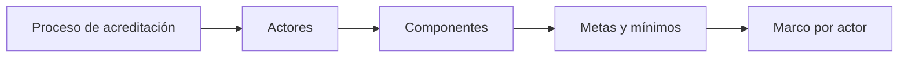

# Actores
> Organiza el universo institucional en actores y componentes con metas, canales y reglas propias.
## Objetivo
Definir a quién debe representar el estudio de acreditación y qué tratamiento muestral recibe cada actor.
## Antes de empezar
- Contar con el alcance del proceso de acreditación.
- Identificar actores institucionales y fuentes de población disponibles.
## Mapa de la pantalla

## Elementos de la pantalla
| Elemento | Para qué sirve | Qué cambia o produce |
|---|---|---|
| Catálogo de actores | Normaliza estudiantes, docentes, administrativos y otros | Estandariza componentes |
| Componente | Separa poblaciones con reglas propias | Crea una unidad de cálculo |
| Meta | Fija precisión, cuota o cobertura | Define el objetivo por actor |
| Canal | Indica cómo se recogerá información | Condiciona la operación |
| Piso y tope | Delimita volumen por actor | Controla factibilidad |
## Cómo se usa
1. Añade los actores incluidos en el proceso.
2. Confirma población, categoría y canal de cada uno.
3. Define meta, piso y tope operativo.
4. Revisa que cada componente tenga una fuente viable.
## Resultado y siguiente paso
- Componentes por actor definidos; el siguiente paso es Contexto de acreditación muestral.
## Estados, alertas y límites
- Actores sin población o fuente solo permiten metas tentativas.
- Una cuota mínima no equivale automáticamente a precisión inferencial.
- Categorías duplicadas fragmentan innecesariamente el cálculo.

## Cómo interpretar lo que ves

Cada actor constituye un componente cuando tiene población, canal y regla propios. Meta, piso y tope controlan factibilidad, pero no deben ocultar si existe o no inferencia estadística. En **Actores de acreditación muestral**, **Catálogo de actores** fija la entrada o decisión inicial y **Piso y tope** muestra el producto que debe ser coherente con ella. Conserva la relación entre el actor, el componente, el canal y su población; una coincidencia en el total no compensa una ruptura en esas unidades.

## Ejemplo guiado

**Componente incompleto.** “Egresados” tiene canal web y meta 150, pero carece de fuente poblacional; “Docentes” aparece dos veces por alias.

**Ordenamiento.** Normaliza **Catálogo de actores**, fusiona duplicados y define un **Componente** sólo cuando tenga población viable. Distingue **Meta**, **Canal** y **Piso y tope** sin presentar una cuota tentativa como precisión.

**Resultado.** Actores calculables separados de aquellos que requieren información adicional.

## Si algo no coincide

Si el mismo actor aparece duplicado por alias, normaliza la categoría antes de repartir metas o sumar resultados. Registra los valores observados en **Catálogo de actores** y **Piso y tope**, junto con la versión del marco y los parámetros activos. No corrijas una tabla o salida por separado: vuelve a la entrada causal y recalcula lo que dependa de ella.

## Ubicación en la jerarquía

- Padre: [[Acreditación]].
