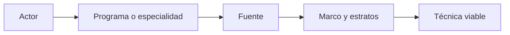

# Contexto
> Completa programa, fuente, estructura del marco y parámetros que dan sentido a cada actor.
## Objetivo
Vincular los componentes de acreditación con su contexto institucional y una técnica compatible.
## Antes de empezar
- Definir los actores y sus metas.
- Reunir tamaños por programa, sede, especialidad u otra capa relevante.
## Mapa de la pantalla

## Elementos de la pantalla
| Elemento | Para qué sirve | Qué cambia o produce |
|---|---|---|
| Programa | Sitúa al actor en el alcance académico | Segmenta el componente |
| Fuente | Registra de dónde sale el universo | Sustenta N y estratos |
| Marco | Define población bruta y contactable | Delimita cobertura |
| Variables de control | Añade programa, actor u otras capas | Habilita distribución |
| Técnica | Vincula inferencia y estructura disponible | Determina el cálculo |
## Cómo se usa
1. Completa programa o especialidad para cada componente.
2. Registra fuente y población disponible.
3. Añade estratos o variables de control relevantes.
4. Comprueba que técnica, meta y canal sean coherentes.
## Resultado y siguiente paso
- Contexto metodológico por actor; el siguiente paso es Resultados de acreditación muestral.
## Estados, alertas y límites
- Una población contactable menor que la bruta reduce la cobertura efectiva.
- Variables de control sin totales no pueden distribuir cuotas.
- Canales distintos pueden requerir reglas operativas distintas aun para el mismo actor.

## Cómo interpretar lo que ves

Programa, fuente, estructura del marco y parámetros explican por qué cada actor recibe un tratamiento diferente. El contexto debe corresponder al mismo proceso y periodo de acreditación. En **Contexto de acreditación muestral**, **Programa** fija la entrada o decisión inicial y **Técnica** muestra el producto que debe ser coherente con ella. Conserva la relación entre el actor, el componente, el canal y su población; una coincidencia en el total no compensa una ruptura en esas unidades.

## Ejemplo guiado

**Incoherencia.** Estudiantes y administrativos comparten por error la misma fuente, técnica y variable de control pese a provenir de marcos distintos.

**Corrección por actor.** Verifica **Programa**, asigna la **Fuente** correspondiente y describe **Marco** y **Variables de control**. Selecciona **Técnica** según la enumeración disponible para ese componente.

**Producto.** Contextos independientes que permiten interpretar por qué cada actor recibe una meta y tratamiento diferentes.

## Si algo no coincide

Si la población de un actor proviene de otra categoría o periodo, detén el cálculo y corrige la fuente antes de compensar con pisos o topes. Registra los valores observados en **Programa** y **Técnica**, junto con la versión del marco y los parámetros activos. No corrijas una tabla o salida por separado: vuelve a la entrada causal y recalcula lo que dependa de ella.

## Ubicación en la jerarquía

- Padre: [[Acreditación]].
