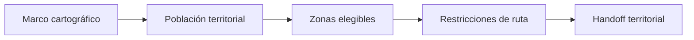

# Diseño de rutas
> Define el alcance territorial y entrega el diseño a Hojas de ruta, donde se resuelven zonas, rutas, viviendas y reemplazos.
## Objetivo
Preparar un marco territorial coherente para que la selección espacial y la operación se planifiquen juntas.
## Antes de empezar
- Contar con marco cartográfico y población por unidad territorial.
- Definir unidad de observación, cobertura geográfica y restricciones de acceso.
## Mapa de la pantalla

## Elementos de la pantalla
| Elemento | Para qué sirve | Qué cambia o produce |
|---|---|---|
| Marco cartográfico | Enumera unidades y límites espaciales | Delimita cobertura |
| Población territorial | Aporta tamaños por zona | Permite asignar metas |
| Unidad de observación | Define persona, hogar u otra unidad | Determina la operación |
| Restricciones | Registra acceso, dispersión y seguridad | Condiciona rutas viables |
| Abrir Hojas de ruta | Transfiere el trabajo al módulo operativo | Continúa diseño espacial |
## Cómo se usa
1. Revisa el marco cartográfico y sus totales de población.
2. Define unidad de observación y zonas elegibles.
3. Registra restricciones que afecten rutas o reemplazos.
4. Abre Hojas de ruta para resolver selección y agenda territorial.
## Resultado y siguiente paso
- Insumos territoriales preparados; el siguiente paso es diseñar zonas y recorridos en Hojas de ruta.
## Estados, alertas y límites
- Este modo no calcula por sí solo rutas, viviendas ni reemplazos espaciales.
- Cobertura cartográfica incompleta produce metas territoriales sesgadas.
- Las restricciones operativas deben documentarse antes de seleccionar zonas.

## Cómo interpretar lo que ves

El calculador prepara cobertura, población y restricciones; Hojas de ruta resuelve zonas, recorridos, viviendas y reemplazos. El traspaso debe conservar la unidad territorial y la procedencia del marco. En **Preparación territorial de muestra**, **Marco cartográfico** fija la entrada o decisión inicial y **Abrir Hojas de ruta** muestra el producto que debe ser coherente con ella. Conserva la relación entre la zona, la unidad territorial y la población asociada; una coincidencia en el total no compensa una ruptura en esas unidades.

## Ejemplo guiado

**Escenario espacial.** Una zona contiene población suficiente, pero su polígono está incompleto y existe una restricción de acceso nocturno.

**Preparación.** Valida **Marco cartográfico** y **Población territorial**, declara **Unidad de observación** y registra **Restricciones** antes del traspaso. No diseñes recorridos dentro del calculador.

**Handoff.** **Abrir Hojas de ruta** recibe zonas elegibles y limitaciones explícitas para resolver rutas, viviendas y reemplazos con la misma versión territorial.

## Si algo no coincide

Si los totales cambian al abrir Hojas de ruta, compara versión, identificadores territoriales y zonas elegibles antes de diseñar recorridos. Registra los valores observados en **Marco cartográfico** y **Abrir Hojas de ruta**, junto con la versión del marco y los parámetros activos. No corrijas una tabla o salida por separado: vuelve a la entrada causal y recalcula lo que dependa de ella.

## Ubicación en la jerarquía

- Padre: [[Territorial]].

