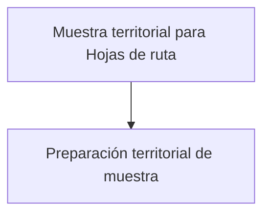

# Territorial

> Deriva los estudios territoriales hacia la planificación espacial de rutas y viviendas.

## Propósito de esta guía

**Muestra territorial para Hojas de ruta** organiza decisiones que cambian el diseño muestral y sus salidas. Deriva los estudios territoriales hacia la planificación espacial de rutas y viviendas. Cada vínculo de esta página conduce exclusivamente a un hijo directo y explica qué pregunta resuelve, qué debe comprobarse allí y qué evidencia queda preparada.

## Antes de recorrer este nivel

Ten disponibles el marco cartográfico, la población por unidad territorial, la unidad de observación y las restricciones de acceso. La selección espacial y los reemplazos se completan en Hojas de ruta. En **Muestra territorial para Hojas de ruta**, confirma siempre que población, marco, parámetros y resultados pertenezcan a la misma versión. Si cambia una fuente, una regla de elegibilidad, una cuota o la semilla, deja de ser válida cualquier selección o salida anterior que dependa de ese dato.

## Mapa de navegación

## Guía de destinos

| Destino | Cuándo entrar | Qué hacer allí | Qué deja listo |
|---|---|---|---|
| [[Diseño de rutas]] | antes de diseñar rutas, para declarar cobertura, población y restricciones espaciales. | Define el alcance territorial y entrega el diseño a Hojas de ruta, donde se resuelven zonas, rutas, viviendas y reemplazos. | un traspaso territorial trazable hacia Hojas de ruta. |

## Recorrido recomendado

1. **Preparación territorial de muestra:** Define el alcance territorial y entrega el diseño a Hojas de ruta, donde se resuelven zonas, rutas, viviendas y reemplazos; al terminar, el resultado es un traspaso territorial trazable hacia Hojas de ruta.

La primera configuración debe seguir ese orden: los insumos delimitan lo seleccionable; el método transforma esos insumos en metas o probabilidades; y el cierre conserva la evidencia. En **Muestra territorial para Hojas de ruta**, empieza por **Preparación territorial de muestra** y termina en **Preparación territorial de muestra**. Para una revisión puntual puedes abrir directamente el destino causal, pero recalcula las tareas posteriores si modificas su entrada.

## Cómo interpretar avance y estados

En **Muestra territorial para Hojas de ruta**, **sin configurar** indica que falta una entrada indispensable; **no evaluado** significa que la entrada existe pero el cálculo aún no se ejecutó; **listo** exige resultados ligados a la versión actual; **requiere atención** señala una inconsistencia concreta. Un valor cero es un resultado numérico y no reemplaza a “sin dato”. En tablas, conserva denominadores, filtros y totales al pasar del resumen al detalle.

## Resultado de este nivel

Al completar **Muestra territorial para Hojas de ruta** quedan visibles los supuestos utilizados, las decisiones que transforman el marco y la evidencia necesaria para reproducir el resultado. Antes de entregar o transferir el diseño, comprueba que nombres, firmas, semillas, totales y fechas correspondan a la misma versión.

## Ubicación en la jerarquía

- Padre: [[Calculador de muestras]].
