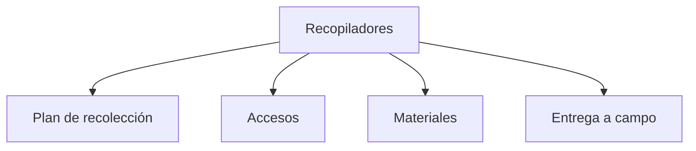

# Recopiladores

> Convierte un plan ya decidido en accesos y materiales de campo, y entrega a Monitoreo un deployment local con recibo trazable.

## Propósito del módulo

Recopiladores prepara el despliegue **antes** del trabajo de campo. Recibe las unidades que otro módulo ya seleccionó y una revisión local del instrumento; no decide la muestra, no crea encuestas y no controla el avance. Su resultado es un `collection_deployment/v1` que enlaza cada unidad con un acceso, materializa piezas de aplicación y puede entregarse a Monitoreo.

La V1 es local-first. Puede inspeccionar targets existentes de Kobo, SurveyMonkey o enlaces entregados manualmente y generar accesos permitidos por sus capacidades. Guardar, previsualizar o entregar no crea collectors, recipients, campañas ni permisos remotos. La propia pantalla muestra `remote_write` como deshabilitado.

## Antes de recorrerlo

Necesitas un plan con identificadores estables y una revisión local del instrumento. Según el proveedor, también hace falta una URL de captura válida o una referencia a un target ya aprovisionado. Las credenciales no se escriben aquí: se usa la referencia al perfil de conexión.

Si el módulo todavía no tiene plan, puede adaptar una fuente compatible una sola vez cuando la pantalla ofrece **Adaptar fuente disponible**. Si no aparece esa opción, vuelve al módulo que decide las unidades y entrégalas desde allí.

## Mapa del recorrido

## Guía de destinos

| Destino | Cuándo entrar | Qué hacer allí | Qué deja listo |
|---|---|---|---|
| [[Plan de recolección]] | Al recibir o adaptar una selección | Confirmar el origen, la revisión del instrumento y las unidades congeladas | Un `collection_plan/v1` legible, sin volver a seleccionar unidades |
| [[Accesos]] | Cuando el plan ya existe | Elegir el adapter, inspeccionar capacidades y construir una vista previa local del vínculo unidad ↔ acceso | Un deployment guardado y preparado sin mutaciones remotas |
| [[Materiales]] | Cuando existe un deployment | Editar la receta semántica, crear instancias y ejecutar preview PNG, PDF o paquete | Artefactos con archivo, hash y número de páginas |
| [[Entrega a campo]] | Después de preparar el deployment | Revisar cobertura y fingerprint y entregar a Monitoreo | Un recibo idempotente y el manifiesto de artefactos |

## Recorrido recomendado

1. En **Plan de recolección**, comprueba el total, tipo y procedencia de las unidades. Un plan vacío puede ser válido, pero no permite preparar materiales útiles.
2. En **Accesos > Canales**, ejecuta el preflight. Distingue lo que soporta el proveedor, lo que implementa Prosecnur y lo que la política V1 permite.
3. En **Accesos > Vinculación**, genera la vista previa, revisa cada identidad lógica, guarda el borrador y pulsa **Preparar** solo cuando no haya bloqueos.
4. En **Materiales > Vista previa**, edita bloques y bindings de la receta. El lienzo es una representación del template; la preview PNG que genera el job del backend es la comprobación autoritativa.
5. En **Materiales > Paquetes**, crea instancias y renderiza el formato requerido. Revisa nombre, MIME, páginas y SHA-256 antes de descargar.
6. En **Entrega a campo**, confirma que el deployment está preparado, que tiene fingerprint y que la cobertura corresponde al plan; entonces usa **Entregar a Monitoreo**.

## Estados y límites

- **Sin plan**: todavía no hay unidades propias para desplegar.
- **Preparado**: el deployment tiene los vínculos y el fingerprint requeridos para el handoff.
- **Stale**: cambió una entrada del deployment; hay que reconciliarlo y prepararlo de nuevo.
- **Entregado**: existe un recibo estable. Repetir el mismo fingerprint no duplica el traspaso.

Un QR visible en el editor no demuestra que el material final sea correcto. La evidencia es el artefacto renderizado por el backend y su recibo. Los binarios y previews regenerables quedan fuera del proyecto `.pulso`; la pantalla conserva referencias y manifiestos, no una copia silenciosa de los archivos.

Las URL y recipient links pueden ser sensibles. Usa solo targets ya autorizados y no pegues tokens o credenciales en los campos de referencia.

## Resultado

Queda un plan versionado, un acceso por unidad cuando corresponde, materiales ligados al deployment y un recibo que Monitoreo puede consumir sin volver a preparar la recolección. El módulo entrega la preparación; la agenda viva, las reprogramaciones, la sincronización, las brechas y el cierre siguen perteneciendo a Monitoreo.

## Dirección

Las cuatro secciones son enlazables bajo `/recopiladores?seccion=<sección>&pestana=<pestaña>`. Los enlaces antiguos de Fichas QR se leen por compatibilidad y la aplicación los reescribe a las direcciones canónicas.

## Ubicación en la jerarquía

- Padre: [[Prosecnur]].
